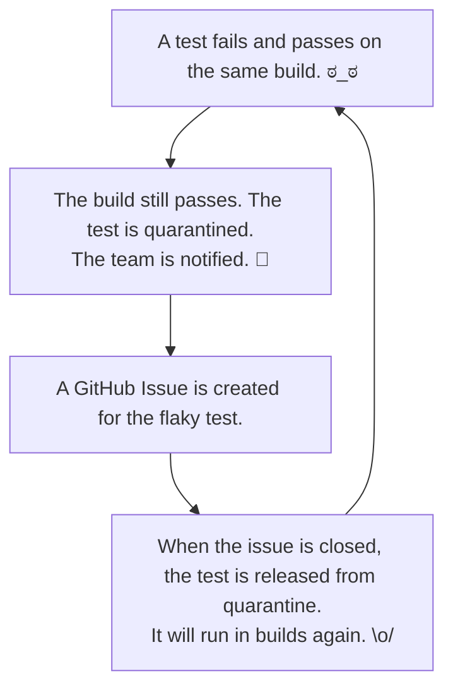

# Quarantine

Quarantine automatically detects, quarantines, and tracks flaky (non-deterministic) tests in CI pipelines.

> "Non-deterministic tests have two problems, firstly they are useless, secondly they are a virulent infection that can completely ruin your entire test suite. As a result they need to be dealt with as soon as you can, before your entire deployment pipeline is compromised." — Martin Fowler, [Eradicating Non-Determinism in Tests]

[Eradicating Non-Determinism in Tests]: https://martinfowler.com/articles/nonDeterminism.html

## How It Works



## Install

**Shell script** (recommended):

```sh
curl -sSL https://raw.githubusercontent.com/mycargus/quarantine/main/scripts/install.sh | bash
```

Pin a version or change the install directory:

```sh
curl -sSL https://raw.githubusercontent.com/mycargus/quarantine/main/scripts/install.sh | VERSION=v0.1.0 bash
curl -sSL https://raw.githubusercontent.com/mycargus/quarantine/main/scripts/install.sh | INSTALL_DIR=./bin bash
```

The script detects your OS and architecture, downloads the binary, and verifies the SHA-256 checksum.

**Build from source:**

```sh
go build -o quarantine ./cli/cmd/quarantine
```

## Quick Start

1. Run `quarantine init` in your repo root:

```sh
quarantine init
```

This auto-detects test frameworks in your project, creates `.quarantine/config.yml`, and sets up the `quarantine/state` branch on GitHub. A minimal config looks like:

```yaml
version: 1

test_suites:
  - name: unit
    command: ["npx", "jest", "--ci"]
    junitxml: "junit.xml"
    rerun_command: ["npx", "jest", "--testNamePattern", "{name}"]
```

`github.owner` and `github.repo` are auto-detected from your git remote.

2. Set `QUARANTINE_GITHUB_TOKEN` (or `GITHUB_TOKEN`) in your CI environment.

3. Add quarantine to your CI workflow:

**Jest** (install `jest-junit` first: `npm install --save-dev jest-junit`):
```yaml
- name: Run tests
  run: quarantine run unit
  env:
    QUARANTINE_GITHUB_TOKEN: ${{ secrets.GITHUB_TOKEN }}

- name: Upload quarantine results
  if: always()
  uses: actions/upload-artifact@v4
  with:
    name: quarantine-results-unit-${{ github.run_id }}
    path: .quarantine/unit/results.json
```

**RSpec** (install `rspec_junit_formatter` first: `gem 'rspec_junit_formatter'`):
```yaml
- name: Run tests
  run: quarantine run backend
  env:
    QUARANTINE_GITHUB_TOKEN: ${{ secrets.GITHUB_TOKEN }}

- name: Upload quarantine results
  if: always()
  uses: actions/upload-artifact@v4
  with:
    name: quarantine-results-backend-${{ github.run_id }}
    path: .quarantine/backend/results.json
```

**Vitest** (built-in JUnit support — no extra dependencies):
```yaml
- name: Run tests
  run: quarantine run frontend
  env:
    QUARANTINE_GITHUB_TOKEN: ${{ secrets.GITHUB_TOKEN }}

- name: Upload quarantine results
  if: always()
  uses: actions/upload-artifact@v4
  with:
    name: quarantine-results-frontend-${{ github.run_id }}
    path: .quarantine/frontend/results.json
```

That's it. Quarantine handles detection, quarantine state, GitHub Issues, and PR comments automatically.

### Multi-suite setup

Configure multiple test suites in a single repo:

```yaml
version: 1

test_suites:
  - name: backend
    command: ["bundle", "exec", "rspec"]
    junitxml: "rspec.xml"
    rerun_command: ["bundle", "exec", "rspec", "-e", "{name}"]

  - name: frontend
    command: ["npx", "jest", "--ci"]
    junitxml: "junit.xml"
    rerun_command: ["npx", "jest", "--testNamePattern", "{name}"]
```

Each suite has its own quarantine state, issues, and PR comments. Run them independently:

```yaml
- run: quarantine run backend
- run: quarantine run frontend
```

### Rerun command placeholders

The `rerun_command` supports these placeholders, substituted from each failing test's JUnit XML entry:

| Placeholder   | Source |
|---------------|--------|
| `{name}`      | `name` attribute from `<testcase>` |
| `{classname}` | `classname` attribute from `<testcase>` |
| `{file}`      | `file_path` component of the test ID |

## Features (v1)

- **Zero-friction integration:** `quarantine init` + `quarantine run <suite>` is the entire setup
- **Multi-suite support:** configure multiple test suites per repo, each with independent state
- **Flaky detection:** re-runs failing tests N times (default 3); a test that fails then passes is flagged as flaky
- **Build protection:** build exits 0 if only newly-quarantined tests failed; quarantined tests are excluded from future builds entirely (*Jest and Vitest; RSpec supports detection only*)
- **GitHub-native state:** quarantine state stored on a dedicated `quarantine/state` branch — no external database
- **GitHub Issues:** one issue per flaky test; closing the issue unquarantines the test
- **PR comments:** per-suite summary of flaky test results posted on each PR
- **Timeouts:** configurable per-suite timeout and rerun timeout with graceful shutdown
- **Dashboard:** web UI with trends and cross-repo analytics (pulls from GitHub Artifacts; read-only in v1)
- **Supported frameworks:** RSpec, Jest, Vitest

## Commands

| Command | Description |
|---------|-------------|
| `quarantine init` | Initialize quarantine for a repo (creates `.quarantine/config.yml` and the state branch) |
| `quarantine run [suite-name]` | Run the named suite with flaky detection and quarantine enforcement (name optional when only one suite is configured) |
| `quarantine status [suite-name]` | Show quarantine status (quarantined test count, oldest tests, duration estimates) |
| `quarantine suite list` | List all configured test suites |
| `quarantine suite remove <name>` | Remove a test suite from the configuration |
| `quarantine doctor` | Validate `.quarantine/config.yml` and print the resolved configuration |
| `quarantine version` | Print the CLI version |

### `quarantine run` flags

| Flag | Description |
|------|-------------|
| `--quiet` | Suppress all informational output (errors only) |
| `--dry-run` | Analyze existing JUnit XML without running tests or writing state |
| `--pr <number>` | Override PR number for comments |
| `--timeout <duration>` | Override the suite's timeout for this run (e.g. `30m`, `1h`) |

## Debugging

### --quiet

Suppresses all informational output. Only errors are printed.

```sh
quarantine run --quiet unit
```

### --dry-run

Analyzes existing JUnit XML results without running the test command or writing quarantine state. Useful for testing your config:

```sh
quarantine run --dry-run unit
```

### quarantine doctor

Validates `.quarantine/config.yml` and prints the resolved configuration, including auto-detected values. Use this to verify your setup:

```sh
quarantine doctor
```

## Architecture

Quarantine follows a GitHub-native architecture. The CLI handles the CI-critical path with no dependencies beyond GitHub. The dashboard is non-critical and discovers data autonomously by polling GitHub Artifacts.

See [`docs/specs/architecture.md`](docs/specs/architecture.md) for the full system design and [`docs/specs/test-strategy.md`](docs/specs/test-strategy.md) for how we test.

## Roadmap

### v1 — GitHub-Native Core *(in progress)*

Zero-friction adoption for teams already on GitHub Actions. Everything runs through your existing `GITHUB_TOKEN` — no new accounts, no SaaS dependencies in the CI path.

- `quarantine init` + `quarantine doctor`
- Multi-suite configuration (`.quarantine/config.yml`)
- Test execution + JUnit XML parsing (Jest, Vitest, RSpec)
- Flaky detection via configurable retry
- Quarantine state on `quarantine/state` branch (SHA-based CAS)
- Pre-execution exclusion of quarantined tests (Jest, Vitest)
- GitHub Issue per flaky test (deduplicated)
- Per-suite PR comment summaries
- Suite management (`suite list`, `suite remove`, `status`)
- Configurable timeouts with graceful shutdown
- Result artifacts for dashboard ingestion
- Web dashboard with trend analytics
- Cross-compiled binaries (linux/darwin x amd64/arm64)

### v2 — Expanded Integrations

- **GitHub App** — fine-grained permissions and short-lived tokens (no PAT required)
- **Monorepo support** — namespace test IDs per project within a single repo
- **More CI providers** — Jenkins, GitLab, Bitbucket
- **More frameworks** — pytest, and others
- **Real-time unquarantine** — GitHub webhooks instead of polling on each run
- **Notification channels** — Slack, email
- **Code sync adapter** — automated PRs to add skip markers directly in source

### v3+ — Scale

- Hosted SaaS dashboard option
- Multi-org support
- Jira ticket integration
- AI-assisted flaky test remediation suggestions

## Troubleshooting

### "GitHub API returned 401 (unauthorized). Check QUARANTINE_GITHUB_TOKEN or GITHUB_TOKEN."

The token is missing or invalid. Quarantine enters degraded mode (tests still run, quarantine state is not updated).

**Fix:** Set `QUARANTINE_GITHUB_TOKEN` in your CI environment. Your repo's `GITHUB_TOKEN` secret works for most setups:

```yaml
env:
  QUARANTINE_GITHUB_TOKEN: ${{ secrets.GITHUB_TOKEN }}
```

If you need higher rate limits or cross-repo access, create a PAT with `repo` scope and add it as a secret.

---

### "No JUnit XML found at 'junit.xml'. Cannot determine test results."

Quarantine could not find the JUnit XML output. This means either the test runner did not produce XML, or it wrote it to a different path.

**Fix — Jest:** Install `jest-junit` and add to your Jest config:
```json
{ "reporters": ["default", "jest-junit"] }
```
Or pass `--reporters=jest-junit` on the command line.

**Fix — RSpec:** Add `rspec_junit_formatter` to your Gemfile and pass `--format RspecJunitFormatter --out rspec.xml`.

**Fix — Vitest:** Pass `--reporter=junit --outputFile=junit-report.xml`.

**Fix — wrong path:** Check the `junitxml` field for your suite in `.quarantine/config.yml`. The glob pattern must match the path where your test runner writes XML output.

---

### "Error: Quarantine is not initialized for this repository. Run 'quarantine init' first."

The `quarantine/state` branch does not exist. This happens when `quarantine init` was never run, or the branch was deleted.

**Fix:** Run `quarantine init` to create (or recreate) the branch:
```sh
quarantine init
```

---

### "GitHub API returned 403 (forbidden). Ensure your token has 'repo' scope."

Your token does not have sufficient permissions. Quarantine enters degraded mode.

**Fix:** Create a PAT with `repo` scope (not just `public_repo`) and set it as `QUARANTINE_GITHUB_TOKEN`.

---

### "GitHub API server error (5xx). Running in degraded mode."

GitHub returned a server error. Quarantine waited 2 seconds, retried once, and still got an error. Tests still ran — quarantine state was not updated for this run.

This is usually transient. If it persists, check [githubstatus.com](https://www.githubstatus.com/).

---

### "GitHub API rate limited (Ns wait exceeds 30s threshold). Running in degraded mode."

Quarantine hit the secondary rate limit and the `Retry-After` header specifies a wait longer than 30 seconds. Rather than block CI, it entered degraded mode.

**Fix:** If this happens frequently, reduce how often your CI runs or switch to a PAT with higher limits.

---

### "GitHub API rate limit low (N remaining, resets at HH:MM UTC)"

Your CI runs are consuming API quota. Quarantine uses approximately 3–5 API calls per run.

**Fix:** Use a PAT instead of `GITHUB_TOKEN` to get 5,000 req/hr instead of 1,000 req/hr:
1. Create a PAT with `repo` scope at <https://github.com/settings/tokens>
2. Add it to your repo secrets: **Settings → Secrets → Actions → New secret**
3. Reference it in your workflow:
   ```yaml
   env:
     QUARANTINE_GITHUB_TOKEN: ${{ secrets.QUARANTINE_PAT }}
   ```

---

### Tests fail to retry / flaky tests not detected

Check that `rerun_command` is correct for your setup. Run `quarantine doctor` to validate your config, then check the `rerun_command` array in `.quarantine/config.yml` for the affected suite.

## Development

### Setup

Prerequisites:
- [asdf](https://asdf-vm.com/) (manages Go and Node.js versions via `.tool-versions`)
- [corepack](https://nodejs.org/api/corepack.html) (manages pnpm version via `packageManager` in `package.json`)

```sh
asdf install
make dev
```

`make dev` verifies prerequisites, installs git hooks, and downloads dependencies for all subdirectories.

> **Note:** `better-sqlite3` compiles a native binary against your Node.js version. After upgrading Node.js, run `pnpm rebuild better-sqlite3` in `dashboard/` to recompile it.

### Claude Code Skills

This project includes skills (invoke with `/skill-name` in Claude Code):

| Skill | Use when |
|-------|----------|
| `/implement-milestone` | Implementing a predefined milestone using TDD and atomic commits |
| `/verify-milestone` | Verifying a milestone's implementation against its manifest |
| `/create-milestone` | Generating a milestone manifest that points agents to source docs |
| `/create-interface-test` | Creating an interface test (CLI binary or HTTP routes, external APIs mocked) |
| `/create-contract-test` | Creating a Prism-based contract test against vendored OpenAPI specs |
| `/create-e2e-test` | Creating an E2E test that verifies real API behavior matches mocks |
| `/review-adr` | Checking if a proposed change contradicts an existing ADR |
| `/create-adr` | Proposing a new Architecture Decision Record |
| `/create-user-scenario` | Writing new Given/When/Then scenarios for a feature or edge case |
| `/sync-docs` | Scanning for inconsistencies between code and documentation |

## Maintainers

See [RELEASING.md](RELEASING.md) for the release process.

## Credit

Inspired by the [quarantine gem] by Flexport.

[quarantine gem]: https://github.com/flexport/quarantine

## License

Copyright (C) 2026 Michael Hargiss. Licensed under the [GNU Affero General Public License v3.0](LICENSE).
