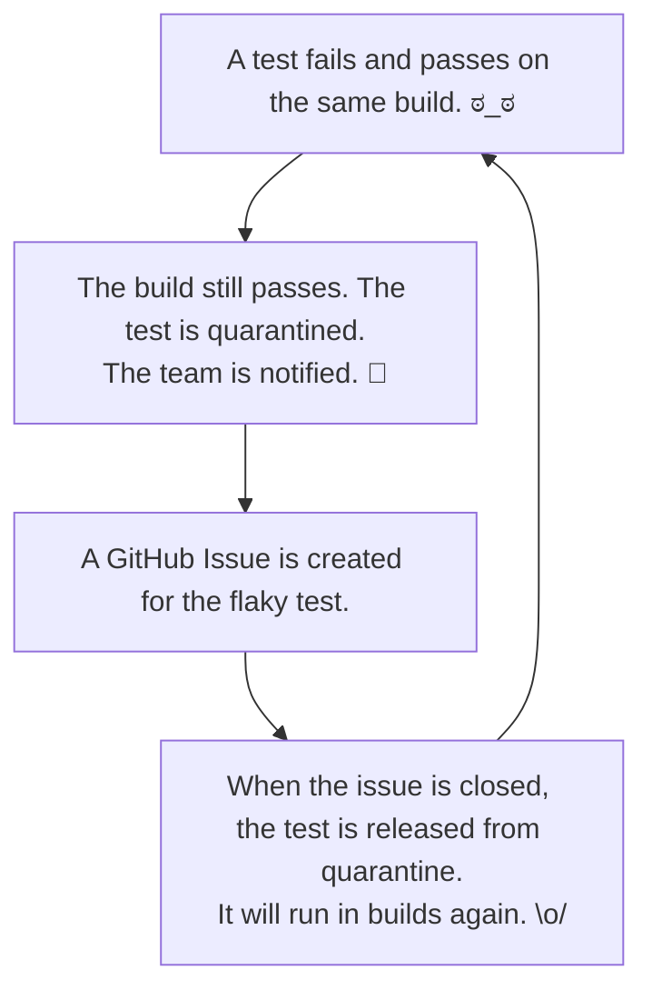

# Quarantine

> *Still under construction!*

Quarantine automatically detects, quarantines, and tracks flaky (non-deterministic) tests in CI pipelines.

> "A test is non-deterministic when it passes sometimes and fails sometimes,
> without any noticeable change in the code, tests, or environment. Such tests
> fail, then you re-run them and they pass. Test failures for such tests are
> seemingly random." — Martin Fowler, [Eradicating Non-Determinism in Tests]

[Eradicating Non-Determinism in Tests]: https://martinfowler.com/articles/nonDeterminism.html

Quarantining flaky tests manually is tedious and error-prone, especially as a test suite grows. Quarantine automates it.

## How It Works



## Quick Start

1. Run `quarantine init` in your repo root:

```sh
quarantine init
```

This interactively creates `quarantine.yml` and the `quarantine/state` branch on GitHub. The minimal config it produces looks like:

```yaml
version: 1
framework: jest  # or rspec or vitest
```

`github.owner` and `github.repo` are auto-detected from your git remote.

2. Set `QUARANTINE_GITHUB_TOKEN` (or `GITHUB_TOKEN`) in your CI environment.

3. Wrap your test command in CI:

```yaml
- name: Run tests
  run: quarantine run -- jest --ci --reporters=default --reporters=jest-junit
  env:
    QUARANTINE_GITHUB_TOKEN: ${{ secrets.GITHUB_TOKEN }}

- name: Upload quarantine results
  if: always()
  uses: actions/upload-artifact@v4
  with:
    name: quarantine-results-${{ github.run_id }}
    path: .quarantine/results.json
```

That's it. Quarantine handles detection, quarantine state, GitHub Issues, and PR comments automatically.

### Non-standard setups (pnpm, bun, custom config)

If your project uses a package manager other than npm, or a custom Jest config, set `rerun_command` in `quarantine.yml`:

```yaml
# pnpm
rerun_command: "pnpm exec jest --testNamePattern '{name}'"

# bun
rerun_command: "bunx jest --testNamePattern '{name}'"

# custom jest config
rerun_command: "npx jest --config jest.ci.config.js --testNamePattern '{name}'"
```

`{name}`, `{classname}`, and `{file}` are substituted with values from the failing test's JUnit XML entry. See [`docs/specs/config-schema.md`](docs/specs/config-schema.md#rerun_command) for the full reference.

## Features (v1)

- **Zero-friction integration:** one command wraps your existing test runner
- **Flaky detection:** re-runs failing tests N times (default 3); a test that fails then passes is flagged as flaky
- **Build protection:** build exits 0 if only newly-quarantined tests failed; quarantined tests are excluded from future builds entirely (*supported test frameworks only)
- **GitHub-native state:** quarantine state stored on a dedicated `quarantine/state` branch — no external database
- **GitHub Issues:** one issue per flaky test; closing the issue unquarantines the test
- **PR comments:** summary of flaky test results posted on each PR
- **Dashboard:** Web UI with trends and cross-repo analytics (pulls from GitHub Artifacts; read-only in v1)
- **Supported frameworks:** RSpec, Jest, Vitest. All three support flaky detection. Jest and Vitest also support automatic exclusion of quarantined tests from subsequent builds; RSpec supports detection only.

## Commands

| Command | Description |
|---------|-------------|
| `quarantine init` | Initialize quarantine for a repo (creates `quarantine.yml` and the state branch) |
| `quarantine run -- <cmd>` | Wrap your test command with flaky detection and quarantine enforcement |
| `quarantine doctor` | Validate `quarantine.yml` and print the resolved configuration |
| `quarantine version` | Print the CLI version |

## Architecture

Quarantine follows a GitHub-native architecture. The CLI handles the CI-critical path with no dependencies beyond GitHub. The dashboard is non-critical and discovers data autonomously by polling GitHub Artifacts.

See [`docs/specs/architecture.md`](docs/specs/architecture.md) for the full system design and [`docs/specs/test-strategy.md`](docs/specs/test-strategy.md) for how we test.

## Roadmap

### v1 — GitHub-Native Core *(in progress)*

Zero-friction adoption for teams already on GitHub Actions. Everything runs through your existing `GITHUB_TOKEN` — no new accounts, no SaaS dependencies in the CI path.

- `quarantine init` + `quarantine doctor`
- Test execution + JUnit XML parsing (Jest, Vitest, RSpec)
- Flaky detection via configurable retry
- Quarantine state on `quarantine/state` branch (SHA-based CAS)
- Pre-execution exclusion of quarantined tests
- GitHub Issue per flaky test (deduplicated)
- PR comment summaries
- Result artifacts for dashboard ingestion
- Web dashboard with trend analytics
- Cross-compiled binaries (4 targets: linux/darwin x amd64/arm64)

### v2 — Expanded Integrations

- **GitHub App** — fine-grained permissions and short-lived tokens (no PAT required)
- **Monorepo support** — namespace test IDs per project within a single repo
- **More CI providers** — Jenkins, GitLab, Bitbucket
- **More frameworks** — pytest, and others
- **Real-time unquarantine** — GitHub webhooks instead of polling on each run
- **Notification channels** — Slack, email
- **Code sync adapter** — automated PRs to add skip markers directly in source

### v3+ — Scale

- Hosted SaaS dashboard option
- Multi-org support
- Jira ticket integration
- AI-assisted flaky test remediation suggestions

## Development

### Setup

Prerequisites: 
- [asdf](https://asdf-vm.com/) (manages Go and Node.js versions via `.tool-versions`)
- [corepack](https://nodejs.org/api/corepack.html) (manages pnpm version via `packageManager` in `package.json`)

```sh
asdf install
make dev
```

`make dev` verifies prerequisites, installs git hooks, and downloads dependencies for all subdirectories.

> **Note:** `better-sqlite3` compiles a native binary against your Node.js version. After upgrading Node.js, run `pnpm rebuild better-sqlite3` in `dashboard/` to recompile it.

### Claude Code Skills

This project includes skills (invoke with `/skill-name` in Claude Code):

| Skill | Use when |
|-------|----------|
| `/implement-milestone` | Implementing a predefined milestone using TDD and atomic commits |
| `/verify-milestone` | Verifying a milestone's implementation against its manifest |
| `/create-milestone` | Generating a milestone manifest that points agents to source docs |
| `/create-contract-test` | Creating a Prism-based contract test against vendored OpenAPI specs |
| `/create-e2e-test` | Creating an E2E test that verifies real API behavior matches mocks |
| `/review-adr` | Checking if a proposed change contradicts an existing ADR |
| `/create-adr` | Proposing a new Architecture Decision Record |
| `/create-user-scenario` | Writing new Given/When/Then scenarios for a feature or edge case |
| `/sync-docs` | Scanning for inconsistencies between code and documentation |

## Credit

Inspired by the [quarantine gem] by Flexport.

[quarantine gem]: https://github.com/flexport/quarantine

## License

Copyright (C) 2026 Michael Hargiss. Licensed under the [GNU Affero General Public License v3.0](LICENSE).
