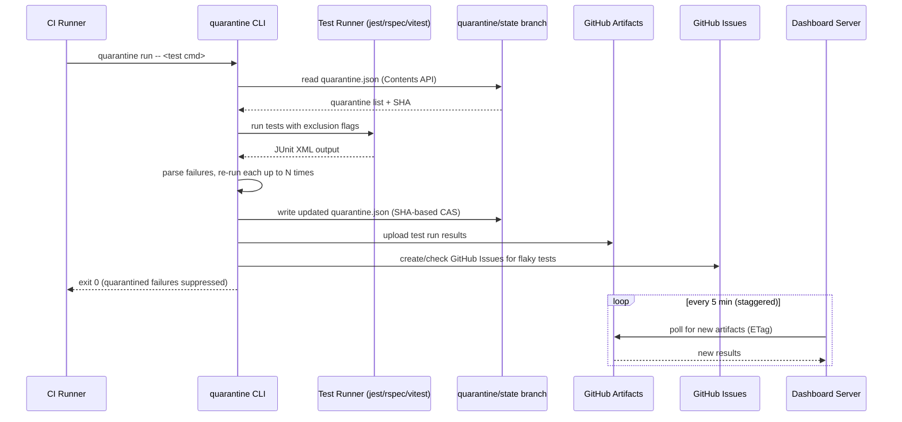
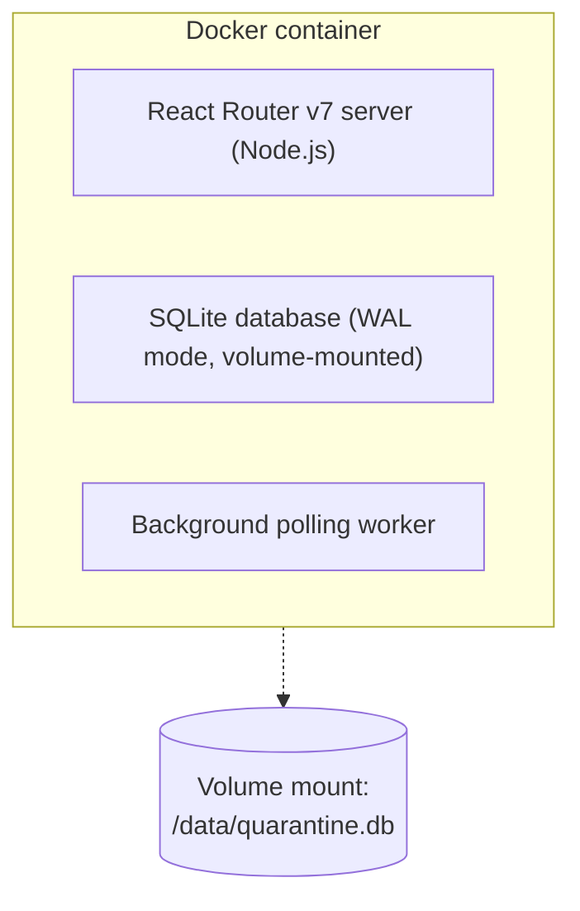

# Quarantine -- Architecture Document

> Last updated: 2026-03-17

## 1. Overview

Quarantine is a developer tool that automatically detects, disables (quarantines), and tracks flaky (non-deterministic) tests in CI pipelines. The system follows a GitHub-native architecture (ADR-011, "Model C"): a Go CLI handles the CI-critical path with no dependencies beyond GitHub, while a separate React Router v7 (framework mode, successor to Remix) dashboard provides analytics and visibility as a non-critical component. When a test fails, the CLI re-runs it to confirm flakiness, excludes quarantined tests before execution via framework-specific flags so they never run, stores quarantine state on a dedicated GitHub branch, uploads results as GitHub Artifacts, and creates GitHub Issues for tracking. The dashboard pulls data from GitHub on a polling schedule to surface trends and cross-repo analytics.

## 2. System Architecture



## 3. Component Breakdown

### 3.1 CLI

| Attribute       | Detail                                                                 |
|-----------------|------------------------------------------------------------------------|
| Language        | Go (ADR-004)                                                           |
| Artifact        | Single statically-linked binary, no runtime dependencies               |
| Targets         | linux/darwin/windows x amd64/arm64 (cross-compiled) [v1]              |
| Distribution    | GitHub Releases (direct binary download) [v1], Docker image [v1]      |
| Config          | `quarantine.yml` in repo root (YAML) (ADR-010)                        |

**Responsibilities:**

- **Test wrapping [v1]:** Execute the user's test command via `quarantine run -- <cmd>`. Parse JUnit XML output (ADR-002) to identify failures (ADR-003). v1 supports RSpec, Jest, and Vitest. Note: some frameworks require third-party tools for JUnit XML (Jest needs `jest-junit`, RSpec needs `rspec_junit_formatter`). Vitest has built-in JUnit XML support via `--reporter=junit` (no third-party package needed). There is no official JUnit XML schema; the format is a de facto standard with cross-framework variations. [v2+] adds pytest, Go (`gotestsum`), JUnit/Maven, PHPUnit, NUnit (uses its own XML format, requires XSLT transform), and others.
- **Flaky detection [v1]:** Re-run failed tests N times (configurable, default 3). A test that fails then passes on retry is classified as flaky (ADR-001). v1 framework-specific rerun caveats:
  - **rspec:** `rspec_junit_formatter` does NOT include line numbers in JUnit XML, so the CLI uses `rspec -e "{name}"` with the test description from the `name` attribute. Note: this may match multiple tests with similar names.
  - **jest:** Rerun via `jest --testNamePattern "{name}"`. Requires `jest-junit` for JUnit XML output.
  - **vitest:** Rerun via `vitest run --reporter=junit {test_file} -t "{test_name}"`. Vitest has built-in JUnit XML support via `--reporter=junit` (no third-party package needed). Uses the same `--testNamePattern` / `-t` flag as Jest for filtering by test name.
  - [v2+] **pytest:** JUnit XML classnames use dots (e.g., `tests.test_payment`) which must be converted to path format (`tests/test_payment.py::test_name`). The CLI transforms dot-separated classnames to file paths and appends `.py`.
  - See ADR-003 for the full rerun command registry.
- **Quarantine enforcement [v1]:** Read quarantine list from `quarantine.json`. Framework-adaptive enforcement (ADR-003): for Jest/Vitest, construct exclusion flags so quarantined tests never execute; for RSpec, let quarantined tests run and suppress their failures from the exit code. There is no JUnit XML rewriting. Exit 0 if only quarantined tests failed.
- **State management [v1]:** Read/write `quarantine.json` on the `quarantine/state` GitHub branch via the GitHub Contents API with SHA-based optimistic concurrency (ADR-006, ADR-012).
- **Result output [v1]:** Write test run results to a local JSON file. The GitHub Actions workflow uploads via `actions/upload-artifact` (ADR-007).
- **Issue management [v1]:** Create GitHub Issues for newly detected flaky tests. On each run, check if associated issues are closed; if so, unquarantine the test.
- **PR comments [v1]:** Post summary comments on pull requests when flaky tests are detected (ADR-009).
- **Code sync adapter [v2+]:** Open automated PRs to add skip markers directly in source code (ADR-003).

### 3.2 Dashboard

| Attribute       | Detail                                                                 |
|-----------------|------------------------------------------------------------------------|
| Framework       | React Router v7 framework mode (TypeScript) (ADR-005)                  |
| Database        | SQLite (WAL mode)                                                      |
| Styling         | Tailwind CSS                                                           |
| Deployment      | Single Docker container [v1]                                           |
| Network         | Internal-only (behind employer's network) [v1], public [v2+]          |

**Responsibilities:**

- **Data ingestion [v1]:** Pull test run results from the GitHub Artifacts API on a polling schedule (every 5 min per org, staggered across repos). On-demand pull when a user views a project (debounced to max 1 pull per repo per 5 min). Uses conditional requests (ETags) (ADR-007). [v2+] Adaptive polling for inactive repos.
- **Analytics [v1]:** Flaky test trends, failure rates, quarantine duration, cross-repo rollup.
- **Quarantine management [v1]:** View and manually manage quarantined tests.
- **Historical analysis [v2+]:** Pattern detection layered on top of stored results (ADR-001).

### 3.3 GitHub Integration

GitHub serves as the central data plane. The CLI interacts with GitHub for all persistent state; the dashboard reads from GitHub but does not write to it.

| GitHub Feature       | Purpose                                  | Version |
|----------------------|------------------------------------------|---------|
| Contents API         | Read/write `quarantine.json`             | v1      |
| Dedicated branch     | `quarantine/state` (never merged)        | v1      |
| Artifacts            | Immutable test run result storage (90d)  | v1      |
| Issues               | Track flaky tests, drive unquarantine    | v1      |
| PR Comments          | Notify developers of flaky tests         | v1      |
| Actions Cache        | Fallback for `quarantine.json` in branch-protected repos | v1 |
| GitHub App           | Fine-grained permissions, short-lived tokens (1-hour expiry), branch protection bypass | v2+ |
| OAuth (remix-auth)   | Dashboard web UI login                   | v2+     |
| Webhooks             | Real-time issue close -> unquarantine    | v2+     |

## 4. Data Flow

### 4.1 Test Run with Flaky Detection

```
1. Developer pushes code; CI triggers.
2. CI runs: quarantine run --junitxml="results/*.xml" -- jest --ci --reporters=default --reporters=jest-junit
   (--junitxml accepts a glob pattern; the CLI merges all matching XML files)
3. CLI reads quarantine.json from quarantine/state branch via Contents API.
   - On GitHub API failure: fall back to cached copy from Actions cache. [v1]
   - Prerequisite: `quarantine init` must be run once per repository (ADR-019).
4. CLI applies framework-adaptive quarantine enforcement (ADR-003):
   - Jest/Vitest: adds exclusion flags to the test command (quarantined tests never run).
   - RSpec: no exclusion flags; all tests run.
5. CLI executes the test command.
6. CLI parses JUnit XML for failures.
7. For each failed test:
   a. If test is in quarantine list -> mark as "quarantined failure" (does not
      count toward exit code, reported in PR comment).
   b. If test is NOT in quarantine list -> re-run up to N times.
   - If it passes on any retry -> classify as flaky.
   - If it fails all retries -> classify as genuine failure.
8. For each newly detected flaky test:
   a. Add to quarantine.json, write back to quarantine/state branch
      (SHA-based compare-and-swap; retry up to 3x on 409 conflict). [v1]
   b. Create GitHub Issue (check-before-create with deterministic labels). [v1]
   c. Post PR comment summarizing findings. [v1]
9. Write results to local JSON file. GitHub Actions workflow uploads as artifact (ADR-007). [v1]
10. Exit code: 0 if only quarantined tests failed, nonzero if genuine failures.
```

### 4.2 Quarantine State Management

```
Read path:
  CLI --[GET Contents API]--> quarantine/state branch --> quarantine.json
  (fallback: GitHub Actions cache with versioned keys)

Write path:
  CLI --[PUT Contents API + SHA]--> quarantine/state branch
  On 409 conflict: re-read, merge, retry (max 3 attempts) [ADR-012]

Branch protection fallback [v1]:
  If quarantine/state branch is protected and CLI cannot push:
  - Use GitHub Actions cache with versioned keys as primary store.
  - [v2+] GitHub App with branch protection bypass permission.
```

### 4.3 Dashboard Data Sync

```
1. Dashboard background worker polls GitHub Artifacts API every 5 minutes
   per org (staggered across repos). [v1]
2. Uses conditional requests (ETags/If-None-Match) to minimize API usage. [v1]
3. Inactive repos (no new artifacts) are polled less frequently (adaptive). [v2+]
4. When a user views a project page, trigger an on-demand pull (debounced
   to max 1 per repo per 5 minutes). [v1]
5. Downloaded artifacts are parsed and stored in SQLite.
6. Dashboard never writes back to GitHub -- read-only consumer.
```

### 4.4 Issue Lifecycle

```
1. CLI detects flaky test -> creates GitHub Issue with deterministic label
   (e.g., "quarantine:flaky", test identifier in title). [v1]
2. Issue serves as tracking ticket for the flaky test.
3. On each CLI run, for each quarantined test:
   a. Check if associated GitHub Issue is closed (via Issues API). [v1]
   b. If closed -> remove test from quarantine.json -> test runs normally again.
4. [v2+] GitHub webhooks notify dashboard in real-time when issues close,
   triggering immediate unquarantine instead of polling on next CLI run.
```

## 5. Data Model

### 5.1 quarantine.json (on quarantine/state branch)

```json
{
  "version": 1,
  "updated_at": "2026-03-14T12:00:00Z",
  "tests": {
    "com.example.TestClass.testMethod": {
      "test_id": "com.example.TestClass.testMethod",
      "suite": "com.example.TestClass",
      "name": "testMethod",
      "first_flaky_at": "2026-03-10T08:30:00Z",
      "last_flaky_at": "2026-03-14T11:45:00Z",
      "flaky_count": 7,
      "issue_number": 42,
      "issue_url": "https://github.com/org/repo/issues/42",
      "quarantined_at": "2026-03-10T08:30:00Z",
      "quarantined_by": "cli-auto"
    }
  }
}
```

**Lifecycle and size management:**

- quarantine.json stores only ACTIVE quarantine state (tests currently quarantined).
- When a test is unquarantined (issue closed), its entry is removed from quarantine.json.
- Historical quarantine data is preserved in the dashboard's SQLite database, ingested from GitHub Artifacts.
- This keeps quarantine.json small and well under the GitHub Contents API 1 MB file limit (~2,500 entries max at that limit, but pruning keeps the file far below this).

### 5.2 Test Run Result (uploaded as GitHub Artifact)

```json
{
  "version": 1,
  "run_id": "abc123",
  "repo": "org/repo",
  "branch": "main",
  "commit_sha": "a1b2c3d4",
  "pr_number": 99,
  "timestamp": "2026-03-14T12:00:00Z",
  "cli_version": "0.1.0",
  "config": {
    "retry_count": 3
  },
  "summary": {
    "total": 150,
    "passed": 145,
    "failed": 2,
    "skipped": 1,
    "quarantined": 2,
    "flaky_detected": 1
  },
  "tests": [
    {
      "test_id": "com.example.TestClass.testMethod",
      "suite": "com.example.TestClass",
      "name": "testMethod",
      "status": "quarantined",
      "original_status": "failed",
      "duration_ms": 340,
      "retries": [
        { "attempt": 1, "status": "failed", "duration_ms": 320 },
        { "attempt": 2, "status": "passed", "duration_ms": 350 }
      ],
      "failure_message": "AssertionError: expected 3, got 4",
      "issue_number": 42
    }
  ]
}
```

### 5.3 Dashboard SQLite Schema

```sql
-- Organizations / accounts
CREATE TABLE orgs (
    id          INTEGER PRIMARY KEY,
    name        TEXT NOT NULL UNIQUE,
    github_url  TEXT NOT NULL,
    created_at  TEXT NOT NULL DEFAULT (datetime('now'))
);

-- Projects (repos)
CREATE TABLE projects (
    id          INTEGER PRIMARY KEY,
    org_id      INTEGER NOT NULL REFERENCES orgs(id),
    name        TEXT NOT NULL,
    full_name   TEXT NOT NULL UNIQUE,  -- "org/repo"
    github_url  TEXT NOT NULL,
    last_synced TEXT,
    last_etag   TEXT,                  -- for conditional requests
    poll_interval_sec INTEGER NOT NULL DEFAULT 300,
    created_at  TEXT NOT NULL DEFAULT (datetime('now'))
);

-- Individual test identifiers
CREATE TABLE tests (
    id          INTEGER PRIMARY KEY,
    project_id  INTEGER NOT NULL REFERENCES projects(id),
    test_id     TEXT NOT NULL,         -- fully qualified test name
    suite       TEXT,
    name        TEXT NOT NULL,
    first_seen  TEXT NOT NULL,
    last_seen   TEXT NOT NULL,
    UNIQUE(project_id, test_id)
);

-- Test run summaries (one row per CI run)
CREATE TABLE test_runs (
    id              INTEGER PRIMARY KEY,
    project_id      INTEGER NOT NULL REFERENCES projects(id),
    run_id          TEXT NOT NULL,
    branch          TEXT,
    commit_sha      TEXT,
    pr_number       INTEGER,
    timestamp       TEXT NOT NULL,
    total           INTEGER NOT NULL,
    passed          INTEGER NOT NULL,
    failed          INTEGER NOT NULL,
    skipped         INTEGER NOT NULL,
    quarantined     INTEGER NOT NULL DEFAULT 0,
    flaky_detected  INTEGER NOT NULL DEFAULT 0,
    cli_version     TEXT,
    artifact_url    TEXT,
    UNIQUE(project_id, run_id)
);

-- Per-test results within a run
CREATE TABLE test_results (
    id              INTEGER PRIMARY KEY,
    test_run_id     INTEGER NOT NULL REFERENCES test_runs(id),
    test_id         INTEGER NOT NULL REFERENCES tests(id),
    status          TEXT NOT NULL,          -- passed, failed, skipped, quarantined
    original_status TEXT,                   -- status before quarantine exclusion
    duration_ms     INTEGER,
    retry_count     INTEGER DEFAULT 0,
    failure_message TEXT,
    issue_number    INTEGER
);

-- Quarantine events (audit log)
CREATE TABLE quarantine_events (
    id          INTEGER PRIMARY KEY,
    test_id     INTEGER NOT NULL REFERENCES tests(id),
    event_type  TEXT NOT NULL,             -- quarantined, unquarantined
    reason      TEXT,                      -- auto-detected, manual, issue-closed
    issue_number INTEGER,
    timestamp   TEXT NOT NULL DEFAULT (datetime('now'))
);
```

SQLite is configured with WAL mode for concurrent reads alongside serialized writes (ADR-012).

## 6. Deployment

### 6.1 CLI Distribution

**[v1] GitHub Releases:**
- Go binary cross-compiled for 6 targets (linux/darwin/windows x amd64/arm64).
- Published as GitHub Release assets on each tagged version.
- Users download directly or via curl one-liner in CI config.
- Checksum file (SHA256) published alongside binaries (ADR-014).

**[v1] Docker image:**
- CLI packaged as a minimal Docker image for environments that prefer containers.

**Example CI usage (GitHub Actions) [v1]:**

```yaml
- name: Install quarantine
  run: |
    curl -sSL https://github.com/org/quarantine/releases/latest/download/quarantine-linux-amd64 \
      -o /usr/local/bin/quarantine && chmod +x /usr/local/bin/quarantine

- name: Run tests
  run: quarantine run -- jest --ci --reporters=default --reporters=jest-junit
  env:
    QUARANTINE_GITHUB_TOKEN: ${{ secrets.GITHUB_TOKEN }}
    JEST_JUNIT_OUTPUT_DIR: ./results
```

### 6.2 Dashboard Deployment

**[v1] Single Docker container:**



- Deploy behind a reverse proxy (nginx, Caddy, or cloud LB).
- Internal-only access [v1] -- no public exposure.
- SQLite database stored on a persistent volume mount.
- Single process handles both web requests and background artifact polling.

**[v2+]:**
- Public deployment with GitHub OAuth authentication.
- Potential migration to managed hosting (Fly.io, Railway).

## 7. Security

### 7.1 Authentication

| Component              | v1                                      | v2+                                     |
|------------------------|-----------------------------------------|-----------------------------------------|
| CLI to GitHub          | `QUARANTINE_GITHUB_TOKEN` (preferred) or `GITHUB_TOKEN` (PAT or Actions token). Note: `GITHUB_TOKEN` is limited to 1,000 req/hr/repo; PATs get 5,000/hr. | GitHub App installation token (short-lived, 1-hour expiry; 5,000–12,500 req/hr based on repo count) |
| Dashboard to GitHub    | GitHub PAT (stored as env var)          | GitHub App installation token           |
| Dashboard web UI       | Network-level (internal only)           | GitHub OAuth via remix-auth             |

**Required GitHub token scopes [v1]:**
- `repo` (read/write contents for quarantine.json, create issues, post PR comments)
- `actions:read` (download artifacts -- dashboard only)

**[v2+] GitHub App permissions:**
- Contents: read/write (quarantine.json branch)
- Issues: read/write
- Pull requests: write (comments, code sync PRs)
- Actions: read (artifacts)

### 7.2 Branch Security

- The `quarantine/state` branch is writable by anyone with repository write access.
- This is an accepted risk for v1 — a threat actor would need repo write access, which already grants more destructive capabilities (e.g., pushing to main, deleting branches).
- Customers may legitimately need to manually edit `quarantine.json` (e.g., as a workaround during incidents).
- [v2+] Mitigation: GitHub App as sole writer with optional branch protection on `quarantine/state`.

### 7.3 Rate Limiting (ADR-015)

| Tier                           | Limit                    | Version |
|--------------------------------|--------------------------|---------|
| Dashboard (internal only)      | Reverse proxy basic rate limiting | v1 |
| Unauthenticated endpoints      | 20 req/min/IP            | v2+     |
| Authenticated endpoints        | 300 req/min/user         | v2+     |
| Artifact polling               | Debounced (max 1/repo/5min) | v1   |
| GitHub API (outbound)          | Circuit breaker on consecutive failures; exponential backoff on 429s | v1 |

### 7.4 Degraded Mode

The system is designed so the CI-critical path (the CLI) never hard-depends on anything other than GitHub, and degrades gracefully even when GitHub is partially unavailable.

- **Dashboard unreachable:** CLI operates normally. Results are uploaded as GitHub Artifacts -- the dashboard will ingest them when it recovers. No data loss. [v1]
- **GitHub API unreachable:** CLI falls back to a cached copy of `quarantine.json` from the GitHub Actions cache. Tests run with the last-known quarantine list. Result upload is skipped (fire-and-forget). [v1]
- **GitHub API rate-limited (429):** CLI applies exponential backoff. Dashboard applies circuit breaker and backs off. [v1]
- **[v2+]:** `quarantine.json` also cached in GitHub Actions cache as a secondary fallback, even when the branch-based primary store is available.

### 7.5 Secrets Handling

- CLI checks `QUARANTINE_GITHUB_TOKEN` first, then falls back to `GITHUB_TOKEN`. Reads from environment variables only -- never from config files.
- `quarantine.yml` contains no secrets (repo name, retry count, etc.).
- Dashboard stores GitHub PAT as an environment variable, never in SQLite.

## 8. Roadmap

### v1 -- Core Functionality

- Go CLI: single binary, cross-compiled for 6 targets.
- Distribution via GitHub Releases (direct binary download).
- Flaky detection by re-running failures (configurable retry count, default 3).
- JUnit XML parsing with pre-execution exclusion of quarantined tests (supports glob patterns for multiple XML files, e.g., `--junitxml="results/*.xml"`).
- Quarantine state in `quarantine.json` on `quarantine/state` GitHub branch.
- SHA-based optimistic concurrency for state updates (retry on 409, max 3).
- Fallback to GitHub Actions cache for branch-protected repos.
- Result upload as GitHub Artifacts (90-day retention).
- GitHub Issue creation for flaky tests (deterministic labels, check-before-create).
- Ticket lifecycle: CLI checks issue status on each run, unquarantines on close.
- PR comments summarizing flaky test findings.
- `quarantine.yml` config file in repo root.
- GitHub Actions as the supported CI provider.
- Dashboard: React Router v7 + SQLite + Tailwind, single Docker container, internal-only.
- Dashboard data sync: poll GitHub Artifacts API every 5 min (staggered, ETag-based).
- Dashboard analytics: flaky test trends, failure rates, quarantine duration.
- Rate limiting: reverse proxy for dashboard, circuit breaker + backoff for GitHub API.
- Degraded mode: CLI works without dashboard; falls back to cached state without GitHub API.
- CLI Docker image distribution.

### v2 -- Expanded Integrations

- Monorepo support:
  - v1 assumes one `quarantine.yml` and one `quarantine.json` per repository.
  - v2 adds a `scope` or `project` field in `quarantine.yml` to namespace test IDs for monorepos.
  - Design consideration: the `quarantine.json` key structure uses the full test ID (including file path) as the key, which naturally namespaces by directory in most frameworks. This can be prefixed with a scope later without breaking existing entries.

- GitHub App: fine-grained permissions, short-lived tokens (1-hour expiry, client-side refresh), branch protection bypass.
- GitHub OAuth for dashboard web UI (via remix-auth).
- Code sync adapter: automated PRs to add skip markers in source code.
- GitHub webhooks for real-time issue-close unquarantine.
- CI providers: Jenkins, GitLab, Bitbucket.
- Notification channels: Slack, email.
- Public dashboard deployment with authenticated rate limiting (20 req/min/IP unauth, 300 req/min/user auth).
- Secondary quarantine.json cache in Actions cache alongside branch store.
- Historical flaky analysis in dashboard (pattern detection).
- Adaptive polling for inactive repos (reduce frequency for repos with no recent CI activity).

### v3+ -- Scale and Monetization

- Multi-org support with usage-based billing.
  - Free: 3 projects, 1,000 test runs/month.
  - Team ($30/mo): 20 projects, 50,000 test runs/month.
  - Business: unlimited.
- Hosted SaaS dashboard option.
- Jira / Linear ticket integration.
- Auto-fix suggestions (AI-assisted flaky test remediation).
- Test impact analysis (skip tests unrelated to changed code).

---

*References: ADR-001 through ADR-015 in `/docs/adr/`.*
