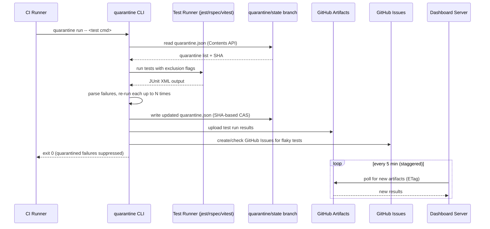
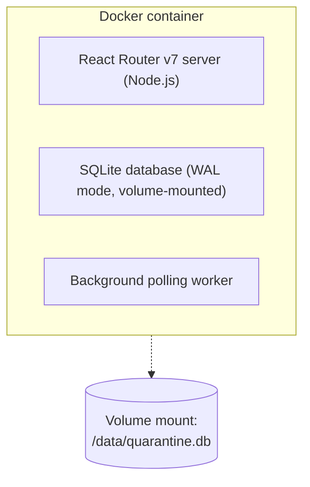

# Quarantine -- Architecture Document

> Last updated: 2026-03-19

## 1. Overview

Quarantine is a developer tool that automatically detects, disables (quarantines), and tracks flaky (non-deterministic) tests in CI pipelines. The system follows a GitHub-native architecture (ADR-011, "Model C"): a Go CLI handles the CI-critical path with no dependencies beyond GitHub, while a separate React Router v7 dashboard provides analytics as a non-critical component. The dashboard pulls data from GitHub on a polling schedule to surface trends and cross-repo analytics.

## 2. System Architecture



## 3. Components

### 3.1 CLI

| Attribute       | Detail                                                                 |
|-----------------|------------------------------------------------------------------------|
| Language        | Go (ADR-004)                                                           |
| Artifact        | Single statically-linked binary, no runtime dependencies               |
| Targets         | linux/darwin/windows x amd64/arm64 (cross-compiled) [v1]              |
| Distribution    | GitHub Releases (direct binary download) [v1], Docker image [v1]      |
| Config          | `quarantine.yml` in repo root (YAML) (ADR-010)                        |

For CLI commands, flags, execution flow, and framework-specific behavior, see `docs/specs/cli-spec.md`. For config schema, see `docs/specs/config-schema.md`.

### 3.2 Dashboard

| Attribute       | Detail                                                                 |
|-----------------|------------------------------------------------------------------------|
| Framework       | React Router v7 framework mode (TypeScript) (ADR-005)                  |
| Database        | SQLite (WAL mode)                                                      |
| Styling         | Tailwind CSS                                                           |
| Deployment      | Single Docker container [v1]                                           |
| Network         | Internal-only (behind employer's network) [v1], public [v2+]          |

**Responsibilities:**

- **Data ingestion [v1]:** Poll GitHub Artifacts API every 5 min per org (staggered across repos). On-demand pull when a user views a project (debounced to max 1 per repo per 5 min). Uses conditional requests (ETags) (ADR-007).
- **Analytics [v1]:** Flaky test trends, failure rates, quarantine duration, cross-repo rollup.
- **Quarantine management [v1]:** View and manually manage quarantined tests.
- **Historical analysis [v2+]:** Pattern detection layered on top of stored results (ADR-001).

### 3.3 GitHub Integration

GitHub serves as the central data plane. The CLI interacts with GitHub for all persistent state; the dashboard reads from GitHub but does not write to it.

| GitHub Feature       | Purpose                                  | Version |
|----------------------|------------------------------------------|---------|
| Contents API         | Read/write `quarantine.json`             | v1      |
| Dedicated branch     | `quarantine/state` (never merged)        | v1      |
| Artifacts            | Immutable test run result storage (90d)  | v1      |
| Issues               | Track flaky tests, drive unquarantine    | v1      |
| PR Comments          | Notify developers of flaky tests         | v1      |
| Actions Cache        | Fallback for `quarantine.json` in branch-protected repos | v1 |
| GitHub App           | Fine-grained permissions, branch protection bypass | v2+ |
| OAuth (remix-auth)   | Dashboard web UI login                   | v2+     |
| Webhooks             | Real-time issue close -> unquarantine    | v2+     |

For GitHub API details, see `docs/specs/github-api-inventory.md`.

## 4. Data Model

Data schemas are defined in `schemas/`:

- **`quarantine-state.schema.json`** -- `quarantine.json` on `quarantine/state` branch. Stores only active quarantine entries; unquarantined tests are removed. Historical data lives in the dashboard's SQLite database, keeping the file well under the Contents API 1 MB limit.
- **`test-result.schema.json`** -- Test run results uploaded as GitHub Artifacts.
- **`quarantine-config.schema.json`** -- `quarantine.yml` configuration file.

Dashboard SQLite schema will be defined during M6 implementation.

## 5. Deployment

### 5.1 CLI Distribution

**[v1] GitHub Releases:**
- Go binary cross-compiled for 6 targets (linux/darwin/windows x amd64/arm64).
- Published as GitHub Release assets on each tagged version.
- Checksum file (SHA256) published alongside binaries (ADR-014).

**[v1] Docker image:**
- CLI packaged as a minimal Docker image for environments that prefer containers.

**Example CI usage (GitHub Actions) [v1]:**

```yaml
- name: Install quarantine
  run: |
    curl -sSL https://github.com/org/quarantine/releases/latest/download/quarantine-linux-amd64 \
      -o /usr/local/bin/quarantine && chmod +x /usr/local/bin/quarantine

- name: Run tests
  run: quarantine run -- jest --ci --reporters=default --reporters=jest-junit
  env:
    QUARANTINE_GITHUB_TOKEN: ${{ secrets.GITHUB_TOKEN }}
    JEST_JUNIT_OUTPUT_DIR: ./results
```

### 5.2 Dashboard Deployment

**[v1] Single Docker container:**



- Deploy behind a reverse proxy (nginx, Caddy, or cloud LB).
- Internal-only access [v1] -- no public exposure.
- SQLite database stored on a persistent volume mount.
- Single process handles both web requests and background artifact polling.
- **[v2+]:** Public deployment with GitHub OAuth authentication.

## 6. Security

### 6.1 Authentication

| Component              | v1                                      | v2+                                     |
|------------------------|-----------------------------------------|-----------------------------------------|
| CLI to GitHub          | `QUARANTINE_GITHUB_TOKEN` (preferred) or `GITHUB_TOKEN` (PAT or Actions token). `GITHUB_TOKEN` is limited to 1,000 req/hr/repo; PATs get 5,000/hr. | GitHub App installation token (1-hour expiry; 5,000-12,500 req/hr) |
| Dashboard to GitHub    | GitHub PAT (stored as env var)          | GitHub App installation token           |
| Dashboard web UI       | Network-level (internal only)           | GitHub OAuth via remix-auth             |

**Required GitHub token scopes [v1]:**
- `repo` (read/write contents for quarantine.json, create issues, post PR comments)
- `actions:read` (download artifacts -- dashboard only)

**[v2+] GitHub App permissions:**
- Contents: read/write (quarantine.json branch)
- Issues: read/write
- Pull requests: write (comments, code sync PRs)
- Actions: read (artifacts)

### 6.2 Branch Security

- The `quarantine/state` branch is writable by anyone with repository write access.
- Accepted risk for v1 -- a threat actor would need repo write access, which already grants more destructive capabilities.
- Customers may legitimately need to manually edit `quarantine.json` during incidents.
- [v2+] Mitigation: GitHub App as sole writer with optional branch protection.

### 6.3 Rate Limiting (ADR-015)

| Tier                           | Limit                    | Version |
|--------------------------------|--------------------------|---------|
| Dashboard (internal only)      | Reverse proxy basic rate limiting | v1 |
| Unauthenticated endpoints      | 20 req/min/IP            | v2+     |
| Authenticated endpoints        | 300 req/min/user         | v2+     |
| Artifact polling               | Debounced (max 1/repo/5min) | v1   |
| GitHub API (outbound)          | Circuit breaker on consecutive failures; exponential backoff on 429s | v1 |

### 6.4 Degraded Mode

The CLI never hard-depends on anything other than GitHub, and degrades gracefully even when GitHub is partially unavailable. See `docs/specs/error-handling.md` for full degradation strategy.

- **Dashboard unreachable:** CLI operates normally. Results upload as artifacts; dashboard ingests on recovery. No data loss.
- **GitHub API unreachable:** CLI falls back to cached `quarantine.json` from Actions cache. Result upload is skipped (fire-and-forget).
- **GitHub API rate-limited (429):** Exponential backoff (CLI), circuit breaker (dashboard).

### 6.5 Secrets Handling

- CLI reads tokens from environment variables only -- never from config files.
- `quarantine.yml` contains no secrets.
- Dashboard stores GitHub PAT as an environment variable, never in SQLite.

## 7. Roadmap

See `docs/planning/milestones.md` for v1 implementation milestones and `docs/milestones/` for per-milestone manifests.

**v2+ directions:** Monorepo support, GitHub App auth, GitHub OAuth for dashboard, code sync adapter (skip markers in source), webhooks for real-time unquarantine, additional CI providers (Jenkins, GitLab, Bitbucket), Slack/email notifications, adaptive polling for inactive repos.

**v3+ directions:** Multi-org support with usage-based billing, hosted SaaS dashboard, Jira/Linear integration, AI-assisted flaky test remediation, test impact analysis.

---

*References: ADR-001 through ADR-019 in `docs/adr/`.*
