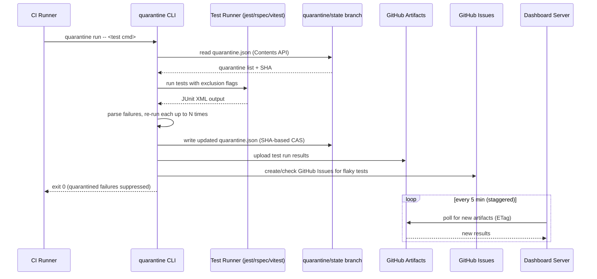

# Quarantine -- Architecture Document

> Last updated: 2026-03-19 (M9 update pending)
>
> **IMPORTANT — M9 migration pending:** The multi-suite plan
> (`docs/plans/multi-suite-support.md`) makes significant changes to state paths,
> artifact paths, and the sequence diagram. Key changes:
>
> - State: `quarantine.json` → `.quarantine/<suite-name>/state.json` (one per suite)
> - Artifacts: `.quarantine/results.json` → `.quarantine/<suite-name>/results.json`
> - PR comment marker: `<!-- quarantine-bot -->` → `<!-- quarantine:<suite-name> -->`
> - Dashboard reads state by listing `.quarantine/` directory then N suite files
> - Command execution: no shell; `exec.Command(command[0], command[1:]...)`
>
> This document will be updated as part of M9 implementation.
> See `docs/milestones/m9.md` for the full scope.

## 1. Overview

Quarantine is a developer tool that automatically detects, disables (quarantines), and tracks flaky (non-deterministic) tests in CI pipelines. The system follows a GitHub-native architecture (ADR-011, "Model C"): a Go CLI handles the CI-critical path with no dependencies beyond GitHub, while a separate web dashboard provides analytics as a non-critical component. The dashboard pulls data from GitHub on a polling schedule to surface trends and cross-repo analytics.

## 2. System Architecture



## 3. Components

### 3.1 CLI

| Attribute       | Detail                                                                 |
|-----------------|------------------------------------------------------------------------|
| Language        | Go (ADR-004)                                                           |
| Artifact        | Single statically-linked binary, no runtime dependencies               |
| Targets         | linux/darwin x amd64/arm64 (cross-compiled) [v1]              |
| Distribution    | GitHub Releases (direct binary download) [v1]                         |
| Config          | `quarantine.yml` in repo root (YAML) (ADR-010)                        |

For CLI commands, flags, execution flow, and framework-specific behavior, see `docs/specs/cli-spec.md`. For config schema, see `docs/specs/config-schema.md`.

### 3.2 Dashboard

| Attribute       | Detail                                                                 |
|-----------------|------------------------------------------------------------------------|
| Framework       | Remix 3 (TypeScript) (ADR-005)                                         |
| Database        | SQLite (WAL mode)                                                      |
| Styling         | Tailwind CSS                                                           |
| Deployment      | Node.js server (direct or containerized) [v1]                          |
| Network         | Internal-only (behind employer's network) [v1], public [v2+]          |

**Responsibilities:**

- **Data ingestion [v1]:** Poll GitHub Artifacts API every 5 min per org (staggered across repos). On-demand pull when a user views a project (debounced to max 1 per repo per 5 min). Uses conditional requests (ETags) (ADR-007).
- **Analytics [v1]:** Flaky test trends, failure rates, quarantine duration, cross-repo rollup.
- **Quarantine management [v1]:** View and manually manage quarantined tests.
- **Historical analysis [v2+]:** Pattern detection layered on top of stored results (ADR-001).

### 3.3 GitHub Integration

GitHub serves as the central data plane. The CLI interacts with GitHub for all persistent state; the dashboard reads from GitHub but does not write to it.

| GitHub Feature       | Purpose                                  | Version |
|----------------------|------------------------------------------|---------|
| Contents API         | Read/write `quarantine.json`             | v1      |
| Dedicated branch     | `quarantine/state` (never merged)        | v1      |
| Artifacts            | Immutable test run result storage (90d)  | v1      |
| Issues               | Track flaky tests, drive unquarantine    | v1      |
| PR Comments          | Notify developers of flaky tests         | v1      |
| Actions Cache        | Fallback for `quarantine.json` in branch-protected repos | v1 |
| GitHub App           | Fine-grained permissions, branch protection bypass | v2+ |
| OAuth (`@remix-run/auth`) | Dashboard web UI login                | v2+     |
| Webhooks             | Real-time issue close -> unquarantine    | v2+     |

For GitHub API details, see `docs/specs/github-api-inventory.md`.

## 4. Data Model

Data schemas are defined in `schemas/`:

- **`quarantine-state.schema.json`** -- `quarantine.json` on `quarantine/state` branch. Stores only active quarantine entries; unquarantined tests are removed. Historical data lives in the dashboard's SQLite database, keeping the file well under the Contents API 1 MB limit.
- **`test-result.schema.json`** -- Test run results uploaded as GitHub Artifacts.
- **`quarantine-config.schema.json`** -- `quarantine.yml` configuration file.

Dashboard SQLite schema will be defined during M6 implementation.

## 5. Deployment

### 5.1 CLI Distribution

**[v1] GitHub Releases:**
- Go binary cross-compiled for 4 targets (linux/darwin x amd64/arm64).
- Published as GitHub Release assets on each tagged version.
- Checksum file (SHA256) published alongside binaries (ADR-014).

**Example CI usage (GitHub Actions) [v1]:**

```yaml
- name: Install quarantine
  run: curl -sSL https://raw.githubusercontent.com/mycargus/quarantine/main/scripts/install.sh | bash
  env:
    VERSION: v0.1.0

- name: Run tests
  run: quarantine run -- jest --ci --reporters=default --reporters=jest-junit
  env:
    QUARANTINE_GITHUB_TOKEN: ${{ secrets.GITHUB_TOKEN }}
    JEST_JUNIT_OUTPUT_DIR: ./results
```

### 5.2 Dashboard Deployment

**[v1] Node.js server:**

- Deploy behind a reverse proxy (nginx, Caddy, or cloud LB).
- Internal-only access [v1] -- no public exposure.
- SQLite database stored on a persistent disk.
- Single process handles both web requests and background artifact polling.
- **[v2+]:** Public deployment with GitHub OAuth authentication.

## 6. Security

### 6.1 Authentication

| Component              | v1                                      | v2+                                     |
|------------------------|-----------------------------------------|-----------------------------------------|
| CLI to GitHub          | `QUARANTINE_GITHUB_TOKEN` (preferred) or `GITHUB_TOKEN` (PAT or Actions token). `GITHUB_TOKEN` is limited to 1,000 req/hr/repo; PATs get 5,000/hr. | Unchanged. CLI receives App-generated tokens via `actions/create-github-app-token` as `QUARANTINE_GITHUB_TOKEN`. CLI code is unchanged; the token source differs (ADR-026). CLI-native App auth (JWT in Go) deferred to non-GitHub-Actions CI milestone. |
| Dashboard to GitHub    | GitHub PAT (stored as env var)          | When `source: github-app`: dashboard generates installation tokens from App private key (JWT + token exchange). When `source: manual`: PAT via env var (unchanged). |
| Dashboard web UI       | Network-level (internal only)           | GitHub OAuth via `@remix-run/auth` with `createGitHubAuthProvider` (ADR-029). No custom OAuth implementation. |

**Required GitHub token scopes [v1]:**
- `repo` (read/write contents for quarantine.json, create issues, post PR comments)
- `actions:read` (download artifacts -- dashboard only)

**[v2+] GitHub App permissions:**
- Contents: read/write (quarantine.json branch)
- Issues: read/write
- Pull requests: write (comments, code sync PRs)
- Actions: read (artifacts)

**[v2+] GitHub App registration:**
- Webhooks disabled in v2 (ADR-027). Dashboard uses API polling for installation discovery and artifact ingestion.
- CLI uses `actions/create-github-app-token` for token generation (ADR-026).
- See the [GitHub App Setup Guide](../guides/github-app-setup.md) for registration steps, CI workflow examples, dashboard env vars, and platform constraints.
- See the [Dashboard Deployment Guide](../guides/dashboard-deployment.md) for deployment configuration.
- See the [CI Integration Guide](../guides/ci-integration.md) for per-framework workflow examples.

### 6.2 Branch Security

- The `quarantine/state` branch is writable by anyone with repository write access.
- Accepted risk for v1 -- a threat actor would need repo write access, which already grants more destructive capabilities.
- Customers may legitimately need to manually edit `quarantine.json` during incidents.
- [v2+] Mitigation: GitHub App as sole writer with optional branch protection.

### 6.3 Rate Limiting (ADR-015)

| Tier                           | Limit                    | Version |
|--------------------------------|--------------------------|---------|
| Dashboard (internal only)      | Reverse proxy basic rate limiting | v1 |
| Unauthenticated endpoints      | 20 req/min/IP            | v2+     |
| Authenticated endpoints        | 300 req/min/user         | v2+     |
| Artifact polling               | Debounced (max 1/repo/5min) | v1   |
| GitHub API (outbound)          | Circuit breaker on consecutive failures; exponential backoff on 429s | v1 |

### 6.4 Degraded Mode

The CLI never hard-depends on anything other than GitHub, and degrades gracefully even when GitHub is partially unavailable. See `docs/specs/error-handling.md` for full degradation strategy.

- **Dashboard unreachable:** CLI operates normally. Results upload as artifacts; dashboard ingests on recovery. No data loss.
- **GitHub API unreachable:** CLI falls back to cached `quarantine.json` from Actions cache. Result upload is skipped (fire-and-forget).
- **GitHub API rate-limited (429):** Exponential backoff (CLI), circuit breaker (dashboard).
- **[v2+] App token exchange failure (dashboard):** If JWT generation or `POST /access_tokens` fails, artifact polling for that installation's repos pauses until the next successful token exchange. Installation discovery loop continues on schedule. Dashboard serves cached data. See `docs/specs/error-handling.md` Category 3.

### 6.5 Secrets Handling

- CLI reads tokens from environment variables only -- never from config files.
- `quarantine.yml` contains no secrets.
- Dashboard stores GitHub PAT as an environment variable, never in SQLite.
- [v2+] Dashboard reads the App private key from `QUARANTINE_APP_PRIVATE_KEY` (env var value) or `QUARANTINE_APP_PRIVATE_KEY_PATH` (file path). Private key is never stored in SQLite, config files, or source code. Generated installation tokens are cached in memory only (not persisted).

## 7. Roadmap

See `docs/milestones/index.md` for v1 implementation milestones and `docs/milestones/` for per-milestone manifests.

**v2+ directions:** Monorepo support, GitHub App auth, GitHub OAuth for dashboard, code sync adapter (skip markers in source), webhooks for real-time unquarantine, additional CI providers (Jenkins, GitLab, Bitbucket), Slack/email notifications, adaptive polling for inactive repos.

**v3+ directions:** Multi-org support with usage-based billing, hosted SaaS dashboard, Jira/Linear integration, AI-assisted flaky test remediation, test impact analysis.

---

*References: ADRs in `docs/adr/`.*
