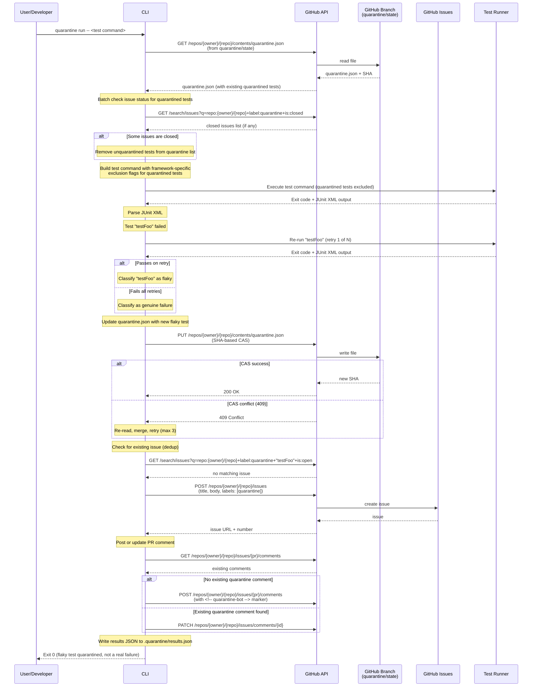
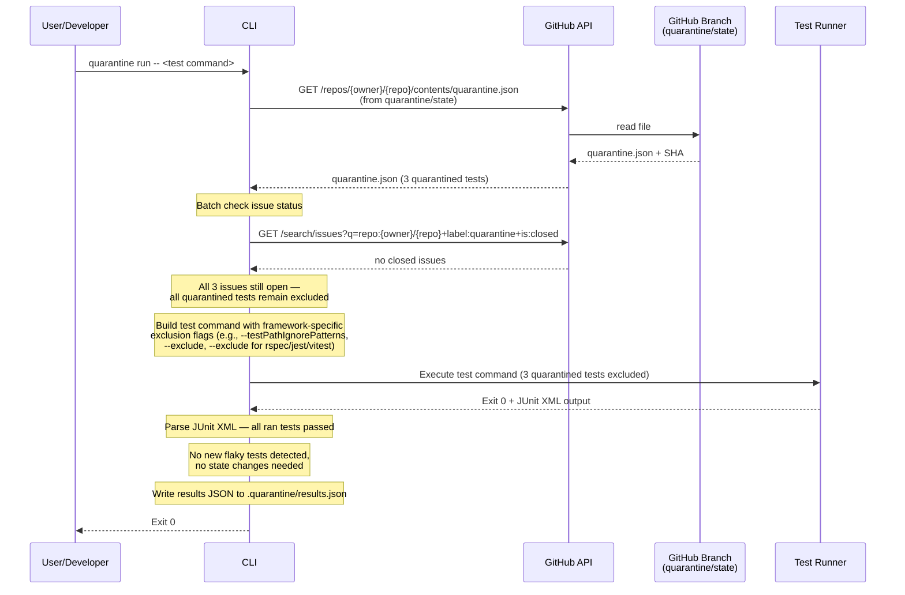
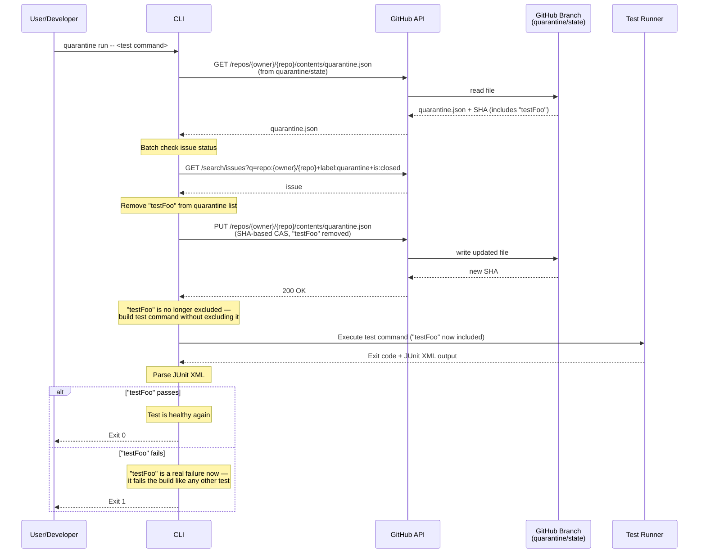
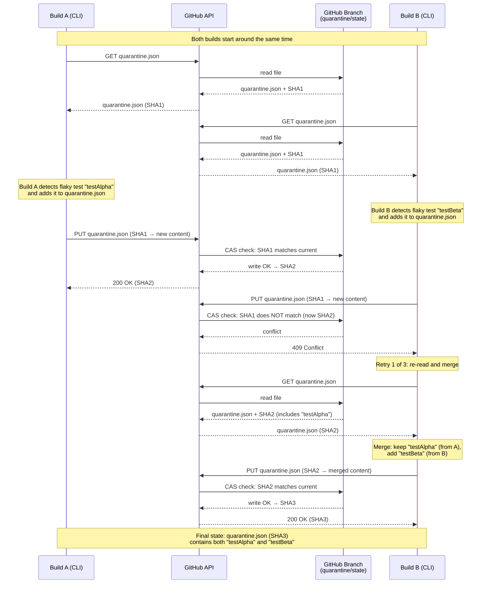
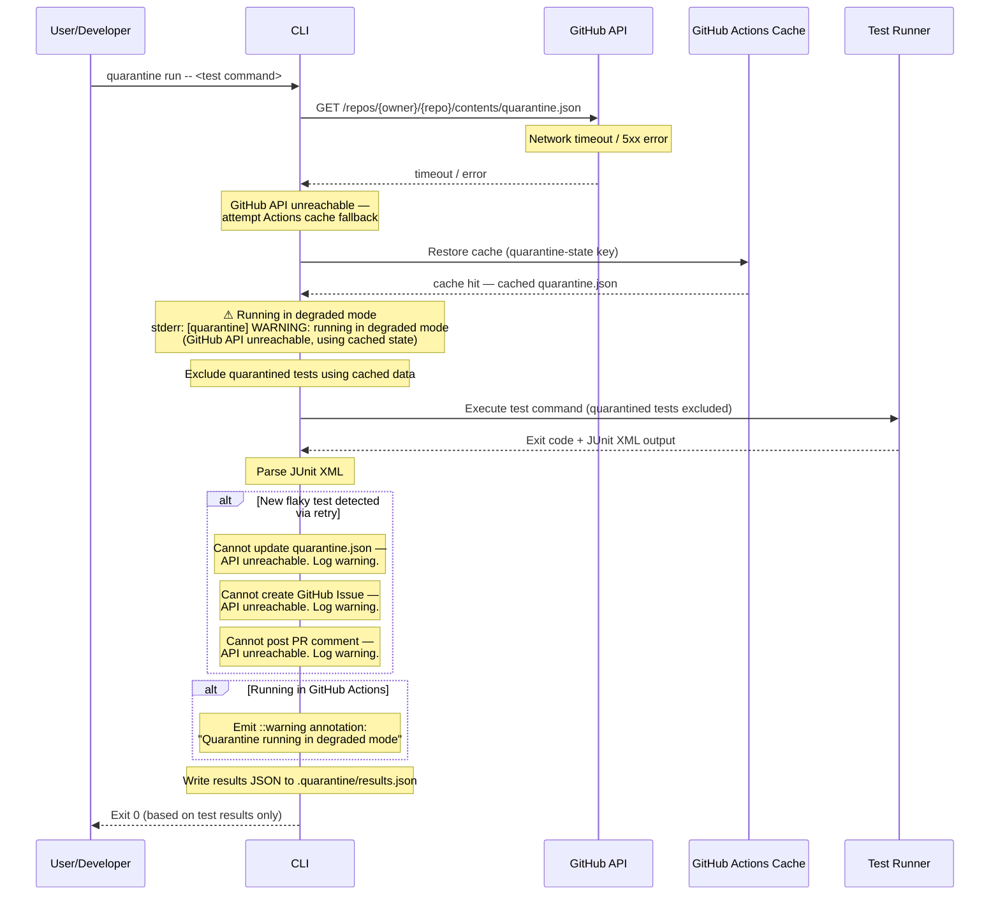
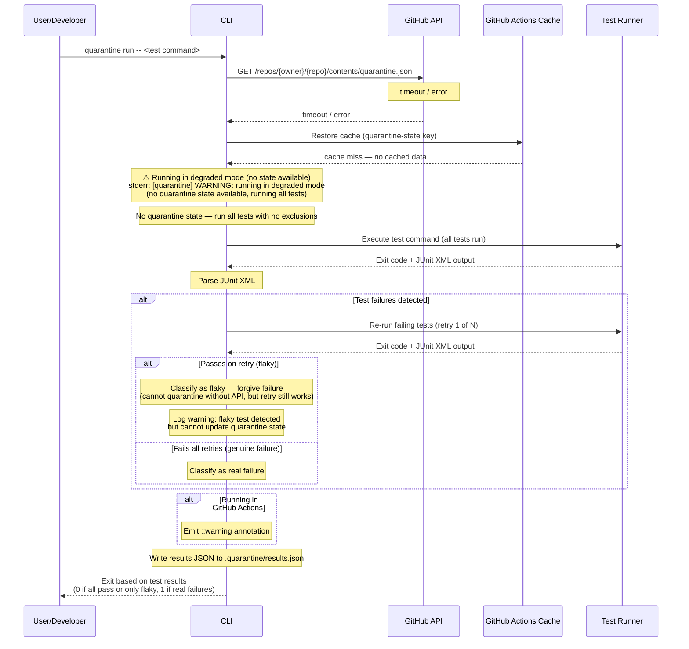
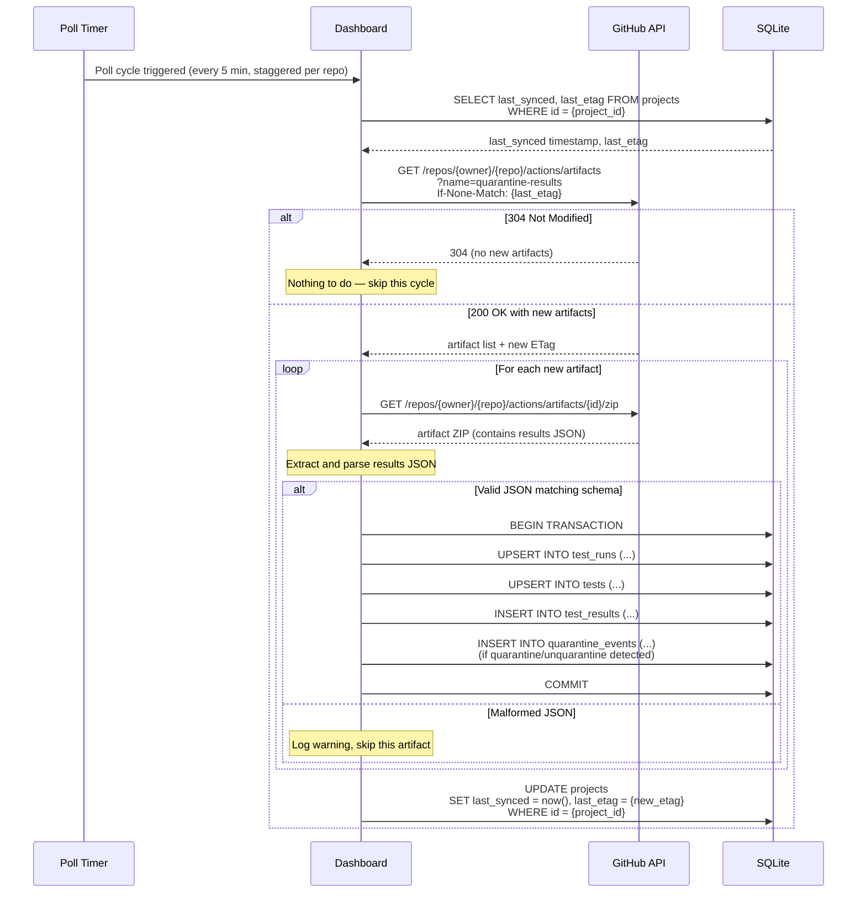
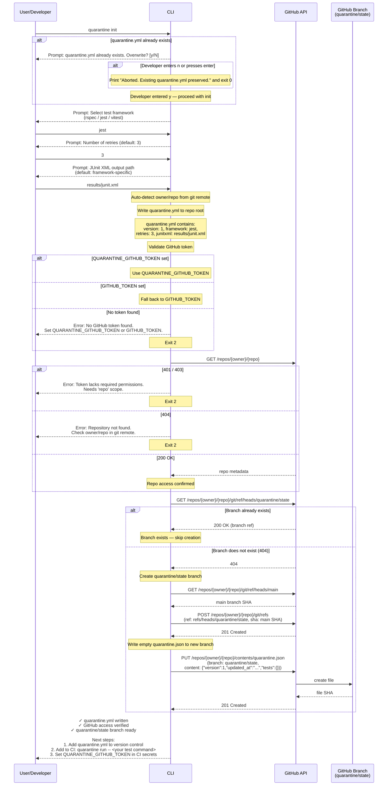

# Sequence Diagrams for Key Flows

> Last updated: 2026-03-17
>
> Mermaid sequence diagrams for the 8 key flows.
> Each diagram is self-contained and renderable in GitHub.

---

## 1. Happy Path: Flaky Test Detected and Quarantined

A test fails on the first run, passes on retry, and is quarantined. The CLI
creates a GitHub Issue, posts a PR comment, writes results to disk, and exits 0.

---

## 2. Happy Path: Quarantined Test Excluded from Execution

All quarantined tests have open issues. They are excluded from the test
command. All remaining tests pass.

---

## 3. Quarantined Test's Issue Is Closed (Unquarantine)

A developer closes a quarantine issue. On the next CLI run, the test is
removed from the quarantine list and runs normally again.

---

## 4. Concurrent Builds: CAS Conflict on quarantine.json

Two CI builds detect flaky tests simultaneously and both try to update
quarantine.json. The second build hits a 409 conflict and retries.

---

## 5. Degraded Mode: GitHub API Unreachable (Cache Hit)

The GitHub API is unreachable, but the CLI falls back to cached
quarantine.json from the GitHub Actions cache.

---

## 6. Degraded Mode: No Cache, No API

Both the GitHub API and Actions cache are unavailable. The CLI runs all tests
with no exclusions but still detects flaky tests via retry.

---

## 7. Dashboard: Artifact Ingestion

The dashboard polls GitHub Artifacts on a schedule, downloads new results,
and upserts them into SQLite.

---

## 8. quarantine init

A developer initializes Quarantine for their repository. The CLI walks them
through interactive prompts, writes configuration, validates access, and
creates the state branch.

---

## Participant Reference

| Participant | Description |
|---|---|
| User/Developer | Human running CLI locally or CI triggering it |
| CLI | The `quarantine` Go binary |
| Test Runner | The wrapped test framework (Jest, RSpec, Vitest) |
| GitHub API | GitHub REST API (Contents, Search, Issues, Artifacts) |
| GitHub Branch | The `quarantine/state` branch storing `quarantine.json` |
| GitHub Issues | GitHub Issues used to track flaky tests |
| GitHub Actions Cache | Fallback cache for `quarantine.json` in degraded mode |
| Dashboard | React Router v7 analytics application |
| SQLite | Dashboard's local database (WAL mode) |
| Poll Timer | Dashboard's scheduled polling worker |
