# Sequence Diagrams for Key Flows

> Last updated: 2026-04-07
>
> Mermaid sequence diagrams for the 12 key flows (8 v1, 4 v2).
> Each diagram is self-contained and renderable in GitHub.

---

## 1. Happy Path: Flaky Test Detected and Quarantined

A test fails on the first run, passes on retry, and is quarantined. The CLI
creates a GitHub Issue, posts a PR comment, writes results to disk, and exits 0.

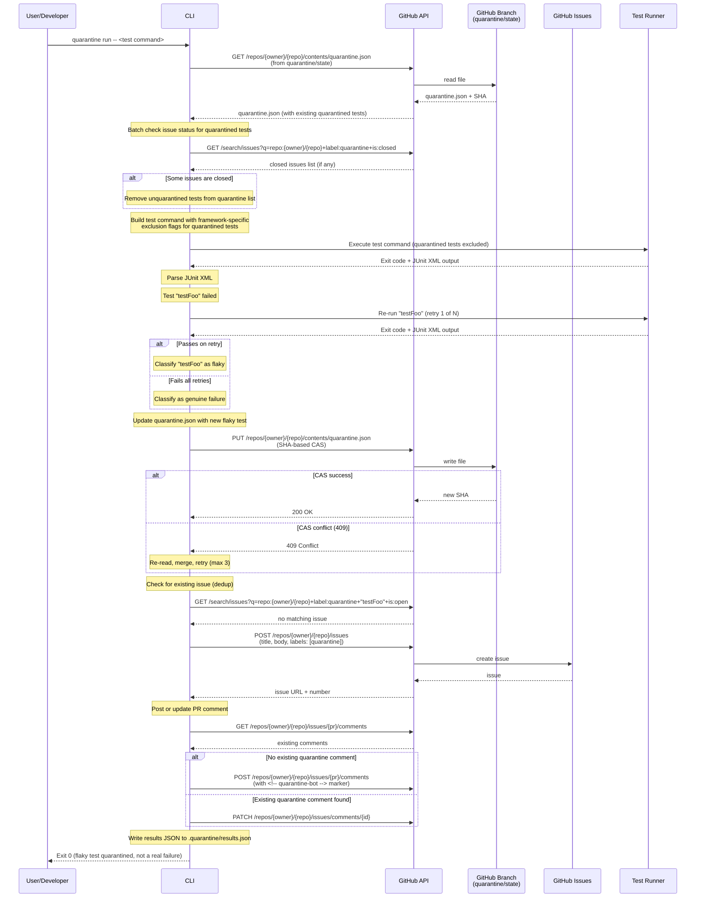

---

## 2. Happy Path: Quarantined Test Excluded from Execution

All quarantined tests have open issues. They are excluded from the test
command. All remaining tests pass.

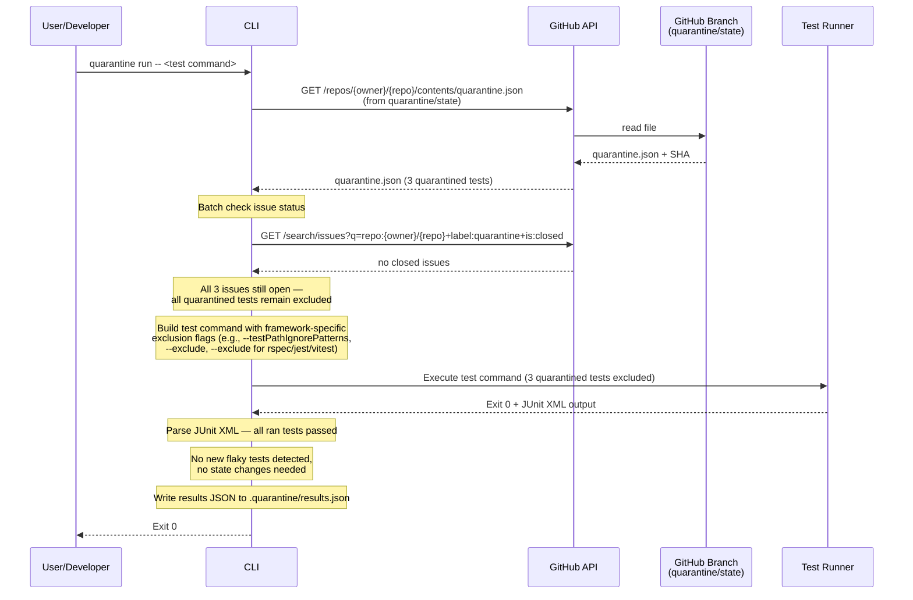

---

## 3. Quarantined Test's Issue Is Closed (Unquarantine)

A developer closes a quarantine issue. On the next CLI run, the test is
removed from the quarantine list and runs normally again.

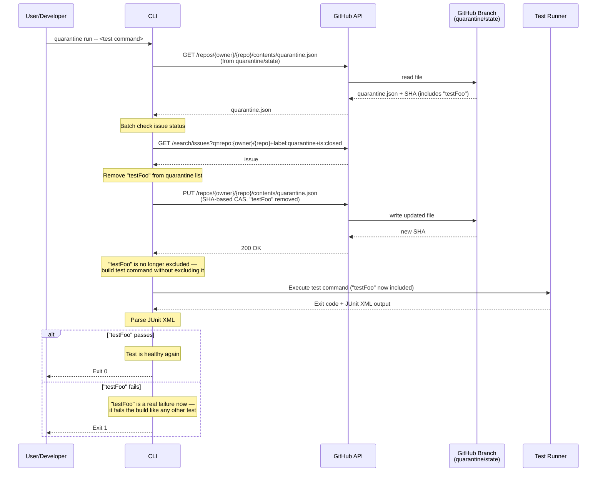

---

## 4. Concurrent Builds: CAS Conflict on quarantine.json

Two CI builds detect flaky tests simultaneously and both try to update
quarantine.json. The second build hits a 409 conflict and retries.

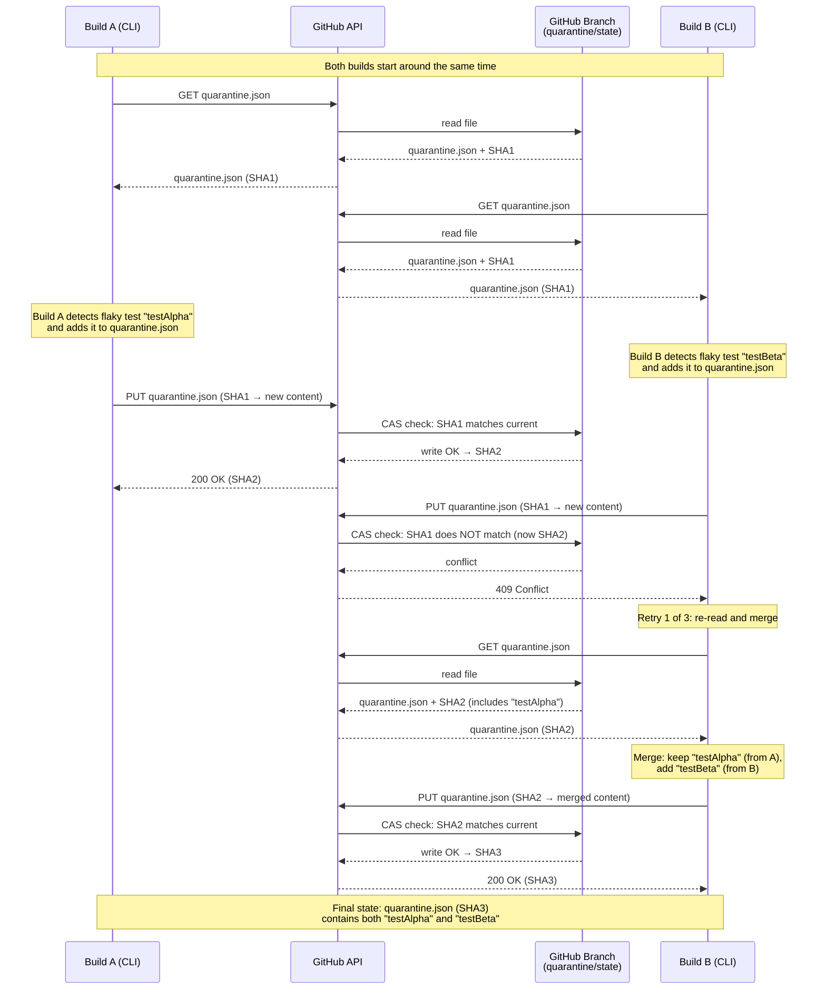

---

## 5. Degraded Mode: GitHub API Unreachable (Cache Hit)

The GitHub API is unreachable, but the CLI falls back to cached
quarantine.json from the GitHub Actions cache.

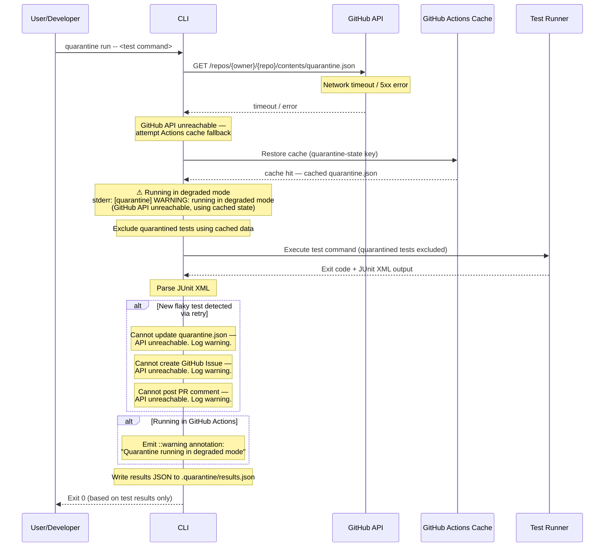

---

## 6. Degraded Mode: No Cache, No API

Both the GitHub API and Actions cache are unavailable. The CLI runs all tests
with no exclusions but still detects flaky tests via retry.

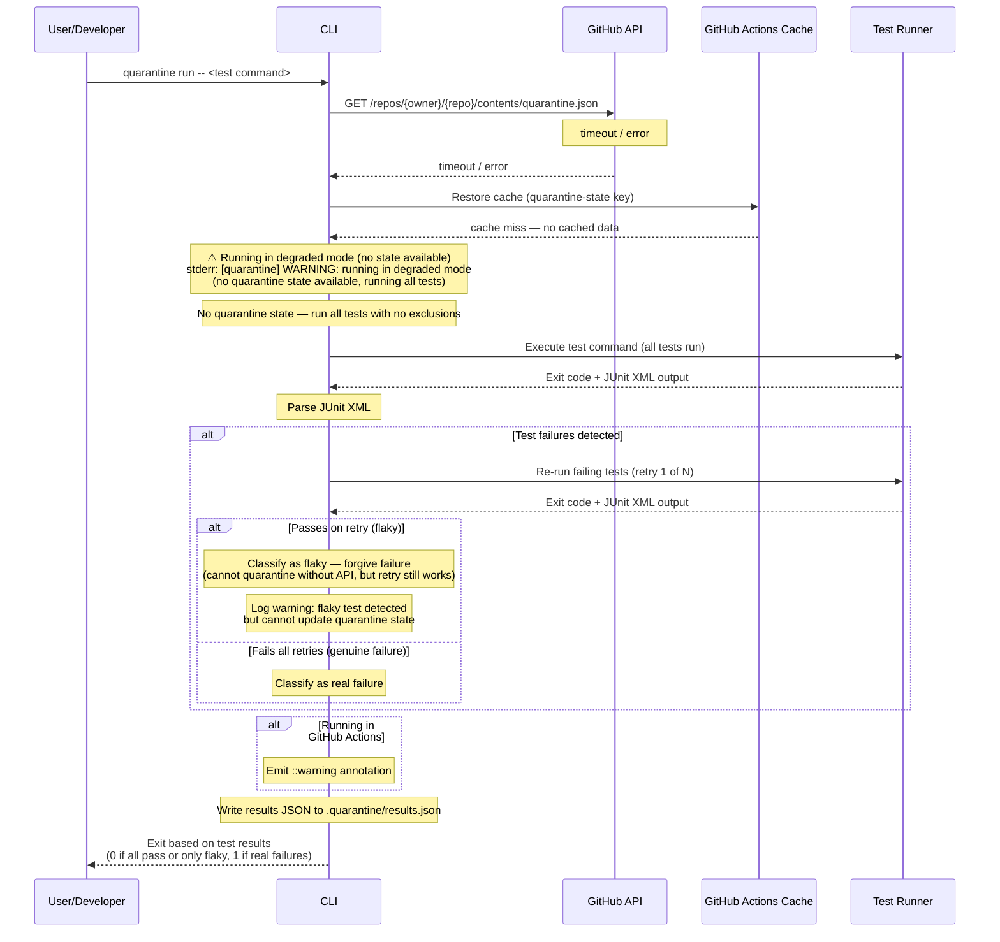

---

## 7. Dashboard: Artifact Ingestion

The dashboard polls GitHub Artifacts on a schedule, downloads new results,
and upserts them into SQLite.

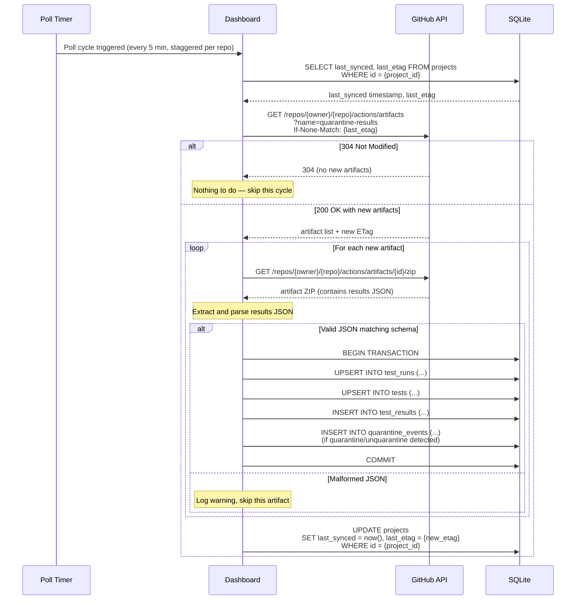

---

## 8. quarantine init

A developer initializes Quarantine for their repository. The CLI walks them
through interactive prompts, writes configuration, validates access, and
creates the state branch.

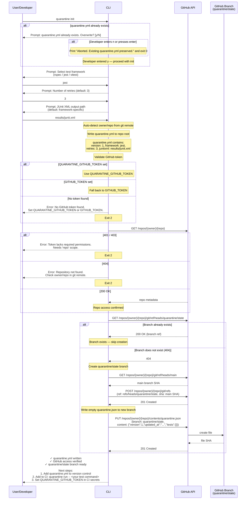

---

## 9. Dashboard: JWT → Installation Token Exchange (v2)

The dashboard generates a JWT from the App's private key, exchanges it for
a short-lived installation token, and uses that token for GitHub API calls.
The `InstallationTokenProvider` caches the token and refreshes proactively.

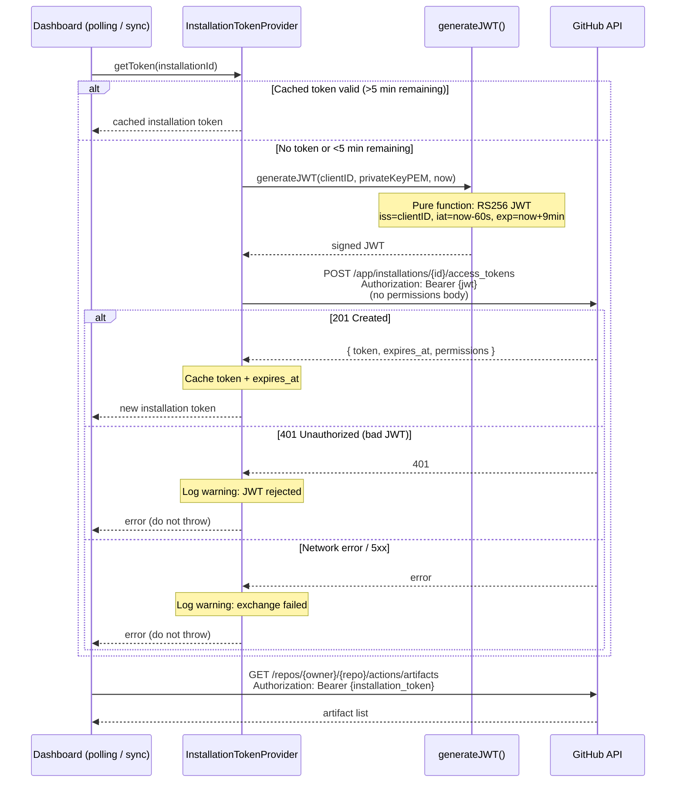

---

## 10. Dashboard: Startup Sync + Discovery Loop (v2)

On startup, the dashboard blocks HTTP traffic until installation discovery
completes. After startup, a 15-minute interval re-syncs periodically.
SIGTERM/SIGINT stops the loop cleanly.

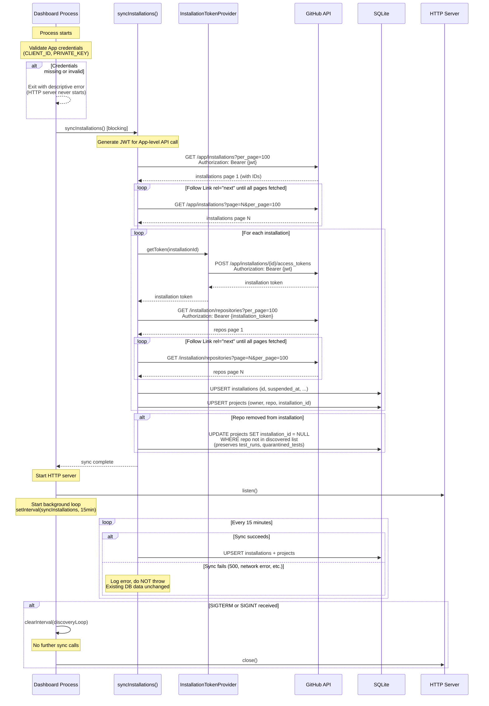

---

## 11. Dashboard: OAuth Login Flow (v2)

A user logs in via GitHub OAuth. `@remix-run/auth` handles the redirect and
code exchange. The dashboard stores the access token in an encrypted session
cookie (8-hour Max-Age). No server-side session table. No refresh tokens.

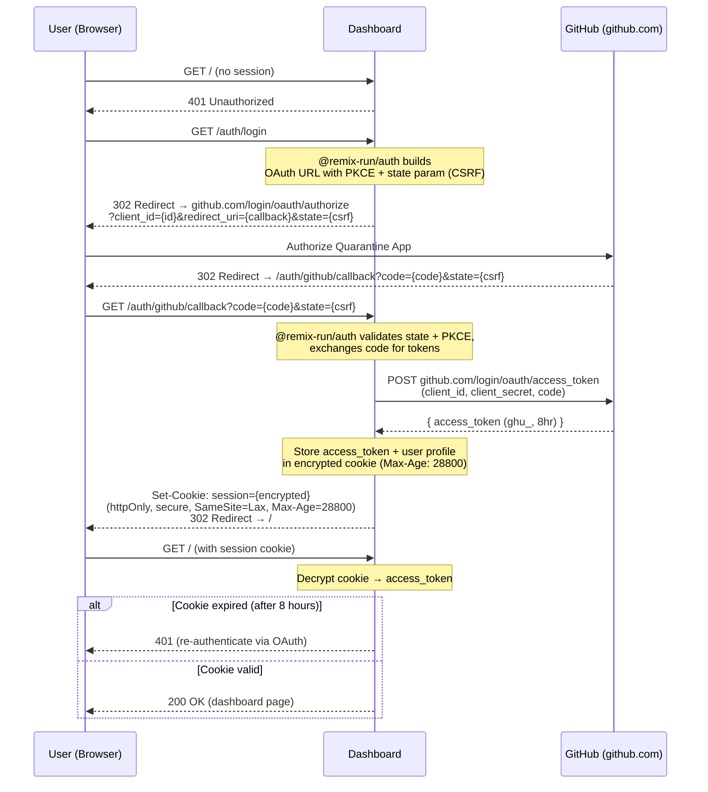

---

## 12. Dashboard: User Permission Filtering (v2)

After OAuth login, the dashboard filters the project list to only repos the
user can access via their GitHub permissions. Note: `GET /user/installations`
returns installation metadata only (no repos). A separate call to
`GET /user/installations/{id}/repositories` per installation is required to
list repos the user can access.

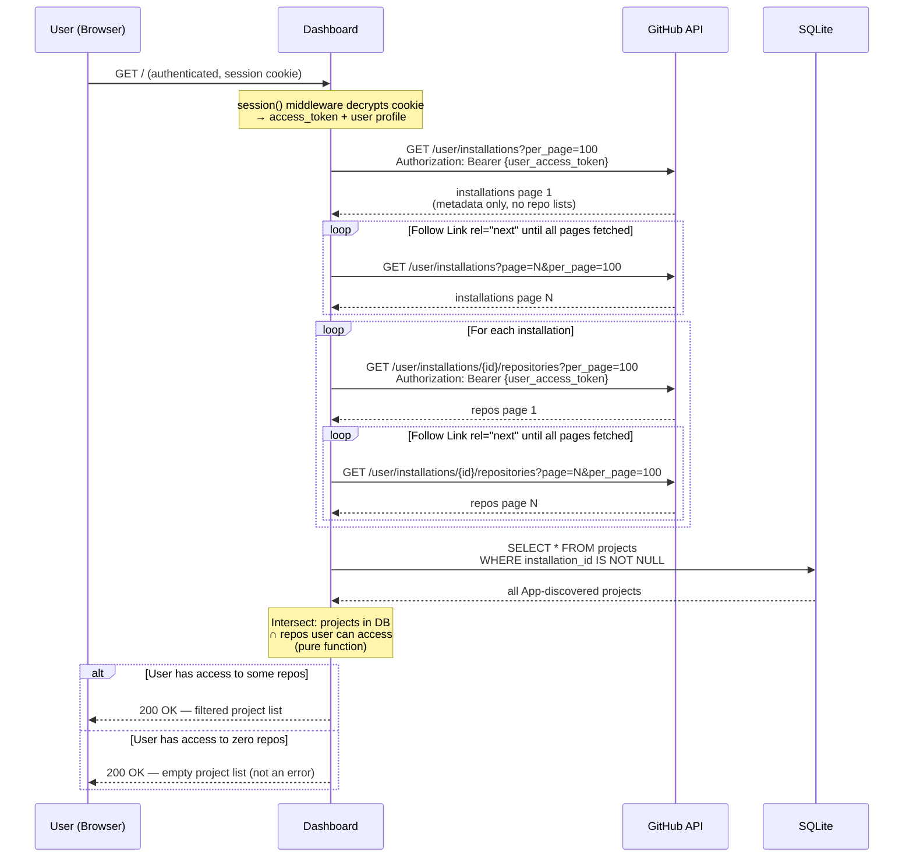

---

## Participant Reference

| Participant | Description |
|---|---|
| User/Developer | Human running CLI locally or CI triggering it |
| CLI | The `quarantine` Go binary |
| Test Runner | The wrapped test framework (Jest, RSpec, Vitest) |
| GitHub API | GitHub REST API (Contents, Search, Issues, Artifacts, App) |
| GitHub Branch | The `quarantine/state` branch storing `quarantine.json` |
| GitHub Issues | GitHub Issues used to track flaky tests |
| GitHub Actions Cache | Fallback cache for `quarantine.json` in degraded mode |
| Dashboard | Remix 3 analytics application |
| SQLite | Dashboard's local database (WAL mode) |
| Poll Timer | Dashboard's scheduled polling worker |
| generateJWT() | Pure function: produces RS256 JWT for App auth (v2) |
| InstallationTokenProvider | Token cache + exchange: JWT → installation token (v2) |
| syncInstallations() | Discovery function: lists installations + repos, upserts DB (v2) |
| GitHub (github.com) | OAuth endpoints on github.com (not api.github.com) (v2) |
